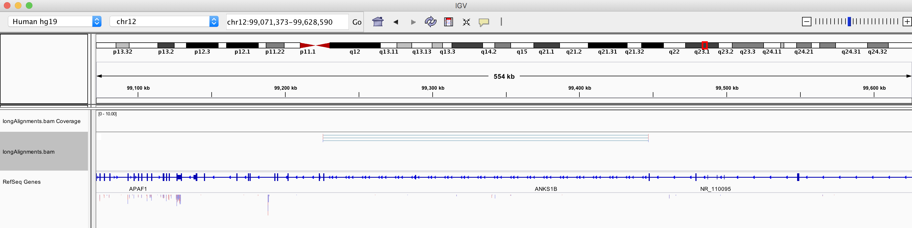

```{r, setup,include=FALSE}
toMessage <- ifelse(!is.null(params$toMessage),params$toMessage,FALSE)
message(toMessage)
```


## Aligned data

In these exercises we will review how we can handle reads in BAM format using the **Rsamtools** and **GAlignments** package.

For these exercises we will be using some of the example data available from the BodyMap consortium. 

We have already reviewed this data when looking at IGV in an earlier session.


The example data can be found in the data directory 

**data/Heart.bam**
**data/Liver.bam**


1. Coordinate sort and index the aligned reads in BAM files **data/Heart.bam** and **data/Liver.bam**.

```{r installdeBSdsed,include=FALSE,  echo=toMessage}
suppressPackageStartupMessages(library(Rsamtools))
suppressPackageStartupMessages(library(GenomicAlignments))
```


```{r installBSzded,  echo=toMessage}
library(Rsamtools)
library(GenomicAlignments)
sortedHeart <- sortBam("data/heart.bodyMap.bam","SortedHeart")
sortedLiver <- sortBam("data/liver.bodyMap.bam","SortedLiver")
indexBam(sortedHeart)
indexBam(sortedLiver)
```

2. Plot the number of mapped reads on every chromsome in the Heart and Liver BAM files using ggplot2

```{r installdaesBSded,  echo=toMessage}
library(ggplot2)
idxHeart <- idxstatsBam(sortedHeart)
idxLiver <- idxstatsBam(sortedLiver)
idxHeartDF <- data.frame(Sample="Heart",idxHeart)
idxLiverDF <- data.frame(Sample="Liver",idxLiver)
toPlot <- rbind(idxHeartDF,idxLiverDF)
ggplot(toPlot,aes(x=seqnames,y=mapped,fill=seqnames))+
  geom_bar(stat="identity")+
  facet_wrap(~Sample)+
  coord_flip()+
  theme_bw()+xlab("Chromosome")
```

3. Using the qwidth() and the width() functions, plot the length of reads vs the length of their alignment for the Heart bam file using ggplot2. Facet the plot by the number of junctions a read spans.


```{r instsallssBSded,  echo=toMessage}
myReads <- readGAlignments("data/heart.bodyMap.bam")
toPlot <- data.frame(readLength=qwidth(myReads),alignmentLength=width(myReads),junctions=factor(njunc(myReads)))
ggplot(toPlot,aes(x=readLength,y=alignmentLength))+
  geom_point()+facet_grid(~junctions)+
  theme_minimal()+xlab("Read Length")+ylab("Alignment Length")
```

4. Export any aligned reads spanning more than 40000 bp on the genome to a BAM file and review in IGV.


```{r installxssBSded,  echo=toMessage}
library(rtracklayer)
export(myReads[width(myReads) > 40000],"longAlignments.bam")

```



5. Import the read IDs, sequence and qualities from the Heart BAM file

```{r instalasaslBSded,  echo=toMessage}
myParam <- ScanBamParam(what=c("qname","seq","qual"))
infoInReads <- readGAlignments("SortedHeart.bam",param = myParam)
```

6. Find the number of unique read IDs and compare to total reads in file.

```{r instalsavbslBSded,  echo=toMessage}
readnames <- mcols(infoInReads)$qname
uniqueIDs <- length(unique(readnames))
totalReads <- length(infoInReads)
```


7. Plot the A,G,C,T,N content of 75bp reads in file. 


```{r insStalsaslBSded,  echo=toMessage}
uniqueReads <- infoInReads[!duplicated(readnames) & qwidth(infoInReads) == 75]
seqOfReads <- mcols(uniqueReads)$seq
alpFreq <- alphabetFrequency(seqOfReads)
sumedAlpFreq <- colSums(alpFreq)
mainBases <- sumedAlpFreq[c("A","C","G","T","N")]
toPlot <- data.frame(Base=names(mainBases),Freq=mainBases)
ggplot(toPlot,aes(x=Base,y=Freq,fill=Base))+geom_bar(stat="identity")+theme_bw()
```

8. Using a loop and ScanBamParam, count the number number reads in Heart file overlapping exons for the SLC25A3 gene. Remember we can use TxDb objects to extract GRanges of exon positions for genes.

```{r instalsasSAlBSded,  echo=toMessage}
library(org.Hs.eg.db)
myIds <- AnnotationDbi::select(org.Hs.eg.db, keys = "SLC25A3", keytype = "SYMBOL", 
            columns = c("SYMBOL", "GENENAME","ENTREZID"))
entrezIDforSLC25A3 <- myIds[,"ENTREZID"]
library(TxDb.Hsapiens.UCSC.hg38.knownGene)
allExons <- exonsBy(TxDb.Hsapiens.UCSC.hg38.knownGene,by="gene")
exonsforSLC25A3 <- allExons[[entrezIDforSLC25A3]]

seqlevels(exonsforSLC25A3) <- "chr12"
  
for(i in 1:length(exonsforSLC25A3)){
  myRegionOfInterest <- exonsforSLC25A3[i]
  myParam <- ScanBamParam(which = myRegionOfInterest)
  ReadsInExons <- readGAlignments("SortedHeart.bam",param = myParam)
  print(length(ReadsInExons))
  
}

```

