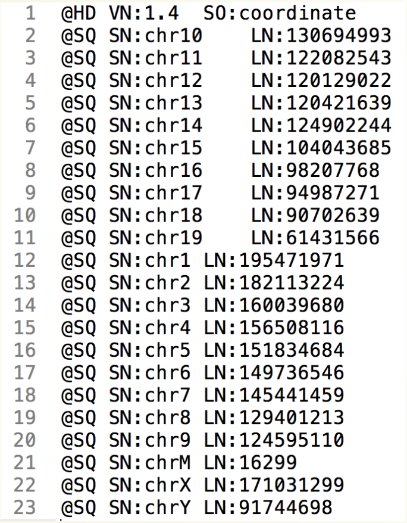

```{r setup, include=FALSE}
knitr::opts_chunk$set(echo = TRUE)
AsSlides <- TRUE
```

```{r setup2, include=FALSE,eval=FALSE,echo=FALSE}
library(ShortRead)
temp <- readFastq("~/Projects/Results/RNAseqPipeTest/FirstTest/FQs/ENCFF000CXH.fastq.gz")

~/Downloads/out.fq
temp <- readFastq("~/Downloads/out.fq")
tAlin <- temp[sample(1:length(temp),10000)]
writeFastq(tAlin,"~/Downloads/sampledActin.fq.gz")
BiocInstaller::biocLite("QuasR")
myFile <- data.frame(FileName="data/sampled_ENCFF000CXH.fastq.gz",SampleName="ENCFF000CXH")
library("BSgenome.Hsapiens.UCSC.hg19")
tis <- BSgenome.Hsapiens.UCSC.hg19[["chr5"]]
writeXStringSet(DNAStringSet(list(chr5=tis)),"chr5.fa")
write.table(myFile,"samples.txt",sep="\t",row.names=FALSE,quote=FALSE)
qAlign("samples.txt","chr5.fa")
library(Rsamtools)
Rsamtools::sortBam("data/sampled_ENCFF000CXH_29a7bd074f7.bam","Sorted_sampled_ENCFF000CXH")
Rsamtools::indexBam("Sorted_sampled_ENCFF000CXH.bam")
myCoverage <- coverage("Sorted_sampled_ENCFF000CXH.bam")
export.bw(myCoverage,con = "Sorted_sampled_ENCFF000CXH.bw")

Rsamtools::indexBam("~/Downloads/ENCFF846QSN.bam")

myFile <- data.frame(FileName="~/Downloads/sampledActin.fq.gz",SampleName="ENCFF000CXH")
library("BSgenome.Hsapiens.UCSC.hg19")
tis <- BSgenome.Hsapiens.UCSC.hg19[["chr7"]]
writeXStringSet(DNAStringSet(list(chr7=tis)),"chr7.fa")
write.table(myFile,"samples.txt",sep="\t",row.names=FALSE,quote=FALSE)
qAlign("samples.txt","chr7.fa",splicedAlignment = TRUE)
library(Rsamtools)
Rsamtools::sortBam("~/Downloads/sampledActin_29a70b5f1d3.bam","sampledActinSpliced")
Rsamtools::indexBam("sampledActinSpliced.bam")
myCoverage <- coverage("Sorted_sampled_ENCFF000CXH.bam")
export.bw(myCoverage,con = "Sorted_sampled_ENCFF000CXH.bw")

Rsamtools::indexBam("~/Downloads/ENCFF846QSN.bam")

```


```{r,results='asis',include=TRUE,echo=FALSE}
if(params$isSlides == "yes"){
  cat("
class: inverse, center, middle

# Aligned Sequences

<html><div style='float:left'></div><hr color='#EB811B' size=1px width=720px></html> 

---
"    
  )
}else{
  cat("

# Aligned Sequences

---
"    
  )
  
}
```

# Aligned Sequences

Aligned sequence reads are stored in BAM format.

<div align="center">

</div>

---
# Aligned Sequences - BAM header

Information on the content and state of BAM file is stored in its header.

<div align="center">

</div>

---
# Aligned Sequences - BAM reads

The body of the BAM file hold information on the original reads.

<div align="center">

</div>

---
# Aligned Sequences - BAM reads

As well as on the positions reads map to in the genome.

<div align="center">

</div>


---
# Aligned data and Bioconductor

Aligned data is handled in Bioconductor using the **GenomicAlignments** package.

**GenomicAlignments** package builds on tools in other packages we have already encountered such as the 
**Rsamtools**, **GenomicRanges**, **ShortRead**, **BSgenome** and **rtracklayer** packages.

---
# From unaligned to aligned data

In our previous session we saw how to align data to the genome using an aligner and that we can use a splice aware aligner to map RNAseq reads across splice junctions.

<div align="center">

</div>


---
# The Data

In this session we will work with aligned data as BAM files. 

I have provided BAM files we saw in our last session as our test data from today.

This can be found in **data/liver.bodyMap.bam**

---
# Rsamtools

We introduced the **Rsamtools** package in our last session to help us post process our newly aligned BAM files.

The Rsamtools package is the basis for many R/Bioconductor packages working with alignments in BAM format including another package we will work with today, the **GenomicAligments** package.

First we can load the **Rsamtools** package.

```{r a1,echo=TRUE,eval=FALSE}
library(Rsamtools)
```

```{r a2,echo=FALSE,eval=TRUE}
suppressPackageStartupMessages(library(Rsamtools))
```

---
# Rsamtools - Sorting by coordinate

We saw in our last session we can sort files using the **sortBam()** function.
This function returns the name of sorted BAM file.

By default the file is sorted by chromosome name and then by coordinates of reads within these chromosomes.


```{r b1,echo=TRUE,eval=TRUE}
coordSorted <- sortBam("data/liver.bodyMap.bam",
                       "Sorted_liver")
coordSorted
```
---

# Rsamtools - Sorting by read name

Some external programs will require reads be sorted by read name, not coordinates. 
To sort by read name we can set the **sortBam** arguement **byQname** to **TRUE**.


```{r c1,echo=TRUE,eval=TRUE}
readnameSorted <- sortBam("data/liver.bodyMap.bam",
                          "SortedByName_liver",
                          byQname=TRUE)
readnameSorted
```

---

# Rsamtools - Optimizing memory

We can control how much memory we use with the **maxMemory** parameter. This allows to sort very large files on smaller memory computers (such as our laptops). 

The maxMemory is specified as the maximum MB of RAM which our **sortBam()** function call can use. In sorting **Rsamtools** will produce mulitple smaller BAM files, the smaller the maxMemory value the greater then number of temporary files.

Here in this example, we sort our file in 1MB of memory and it will produce several temporary files.


```{r d1,echo=TRUE,eval=TRUE}
coordSorted <- sortBam("data/liver.bodyMap.bam",
                          "Sorted_liver",
                          maxMemory=1)
coordSorted
```

---

# Rsamtools - Indexing

Once we have a coordinate sorted file we can index these files to allow for use in other programs such as IGV.

Importantly for us, an indexed BAM file allows us to access information from a BAM file by genomic location.


```{r e1,echo=TRUE,eval=TRUE}
indexBam("Sorted_liver.bam")
```


---
# Rsamtools - Summary

We saw in our last session that we can use **quickBamFlagSummary()** function to get information on alignnment rates and other BAM flags.

```{r f1,echo=TRUE,eval=TRUE}
quickBamFlagSummary("Sorted_liver.bam")
```

---
# Rsamtools  - Summary

Despite the name, the **quickBamFlagSummary** can take a noticeable amount of time when working with large files.

To get a very quick overview of number of mapped reads we can use the indexed BAM file and the **idxstatsBam()** function.

The **idxstatsBam()** function returns a data.frame containing chromosome name, chromosome lengths and number of mapped reads.

```{r g1,echo=TRUE,eval=TRUE}
idxstatsBam("Sorted_liver.bam")
```

---

# GenomicAlignments

Importing and handling of BAM files is handled largely in the GenomicAlignments package.

We first load the package.

```{r aa1,echo=TRUE,eval=FALSE}
BiocManager::install('GenomicAlignments')
library(GenomicAlignments)
```

```{r aa2,echo=FALSE,eval=TRUE}
suppressPackageStartupMessages(library(GenomicAlignments))
```
---
# GenomicAlignments - BAM header

We saw in our earlier sessions on file formats that BAM files contain header information.

This header information provides a list of the chromosomes used and their lengths as well as the current state of BAM sorting (unsorted, coordinate or by name).

Additional information on programs used in processing of BAM file may also be present in BAM header

---
# GenomicAlignments - BAM header

We can retrieve the BAM header in R using the **scanBamHeader()** function and the name of the file we wish to access header information from.

Header information is returned as a list. 

```{r ba2,echo=TRUE,eval=TRUE}
myHeader <- scanBamHeader("Sorted_liver.bam")
str(myHeader)
```

---
# GenomicAlignments - BAM header

We can access useful information such as chromosome names and lengths as with other lists using **$** accessors.
The first level of list is the file names.
The second levels of list are

* Chromosome names and lengths - named **targets**
* Unparsed Text from lines of header - named **text**

```{r ca2,echo=TRUE,eval=TRUE}
names(myHeader)
names(myHeader$Sorted_liver.bam)
```

---

# GenomicAlignments - BAM header

The chromosome lengths are stored in a named vector under the **targets list**.

```{r da2,echo=TRUE,eval=TRUE}
myHeader$Sorted_liver.bam$targets
```
---

# GenomicAlignments - BAM header

The **text list** contains information on sorting and programs.

```{r ea2,echo=TRUE,eval=TRUE}
myHeader$Sorted_liver.bam$text
```

---
# GenomicAlignments - BAM header

We can see the order by reviewing the **HD** element. Here we sorted by coordinate.

```{r fa2,echo=TRUE,eval=TRUE}
myHeader$Sorted_liver.bam$text["@HD"]
```

---
# GenomicAlignments - BAM header

We can check the order for our name sorted BAM file too.

```{r ga2,echo=TRUE,eval=TRUE}
myHeader <- scanBamHeader("SortedByName_liver.bam")
myHeader$SortedByName_liver.bam$text["@HD"]
```

---

# GenomicAlignments - BAM header

We can see the program information by reviewing the **PG** element.
Note that **PG** elements are not always complete and depend on tools used. Here we can see aligner, version used and the command line command itself.

```{r ha2,echo=TRUE,eval=TRUE}
myHeader <- scanBamHeader("Sorted_liver.bam")
myHeader$Sorted_liver.bam$text["@PG"]
```

---


# GenomicAlignments - BAM Alignments

Now we have an idea how our BAM was constructed, we want to start to retrieve some of the data from our BAM file.

We can use the **readGAlignments()** function to import the BAM data into R. 

The returned object is a **GAlignments** object.


```{r ia2,echo=TRUE,eval=TRUE}
myReads <- readGAlignments("Sorted_liver.bam")
class(myReads)
```

---
# GAlignment objects

The resulting **GAlignments** object contains much of the information we saw in the SAM file earlier on. 

This include the chromosome, strand, start and end position of alignment.


```{r ja2,echo=TRUE,eval=TRUE}
myReads[1:2,]
```


---
# GAlignment objects

These objects are similar to **GRanges** objects, as we have the **width** of our ranges (end coordinate - start coordinate) in the **GAlignments** objects.

Additionally we have the **qwidth** which contains information on the width of the original read. 


```{r la2,echo=TRUE,eval=TRUE}
myReads[1:2,]
```

---
# GAlignment objects

The **GAlignments** object also contains information on the **cigar** strings within alignments and the number of junctions a read spans in the **njunc** column

Cigar strings denote the matches against reference.

75M - This is 75 matches in a row.

```{r ma2,echo=TRUE,eval=TRUE}
myReads[1:2,]
```


---
# GAlignment objects - Accesors

The **GAlignments** object inherits much of the functionality we have seen with **GRanges** object.

We can access information using the same accessors as we saw with GRanges objects.

```{r na2,echo=TRUE,eval=TRUE}
seqnames(myReads)
start(myReads)[1:2]
```

---
# GAlignment objects - Accesors

The **GAlignments** object also has some new accessors to access the cigar and njunc information using the **cigar** and **njunc** functions.


```{r na222,echo=TRUE,eval=TRUE}
cigar(myReads)[1:2]
njunc(myReads)[1:2]
```

---
# GAlignment objects - Indexing

We can also index and subset the same way as with **GRanges** objects.

Here we only keep reads on positive strand.

```{r oa2,echo=TRUE,eval=TRUE}
myReads[strand(myReads) == "+"]
```

---
# GAlignment objects - Narrow

We can alter range positions using the GenomicRanges **narrow()** function.

Here we resize our reads to be the 5' 1st base pair at the beginning of every read. Note that **narrow()** function does not take notice of strand.

The cigar strings and njunc will automatically be altered as well.

```{r pa2,echo=TRUE,eval=TRUE}
my5primeReads <- narrow(myReads, start=1, width = 1)
my5primeReads[1:2]
```

---
# GAlignment objects - Narrow

We can control this ourselves with a little subsetting. 

```{r qa2,echo=TRUE,eval=TRUE}
myReadsPos <- narrow(myReads[strand(myReads) == "+"],
                     start=1, width = 1)
myReadsNeg <- narrow(myReads[strand(myReads) == "-"],
                     end=-1, width = 1)

my5primeReads <- c(myReadsPos,myReadsNeg)
my5primeReads[1:2]
```

---
# GAlignments to GRanges 

We can convert a GAlignments object to a GRanges to take advantage of other functions using the **granges()** function. 

This is most useful when reads align continously to a genome (WGS, ChIP-seq, ATAC-seq).

```{r ra2,echo=TRUE,eval=TRUE}
myReadAsGRanges <- granges(myReads,use.mcols = TRUE)
myReadAsGRanges
```

---
# GAlignments to GRanges

To convert RNA-seq reads which may span exons is a little more difficult. Since a read can potentially span multiple exons,a single read may need to be converted to multiple ranges.

To solve this we can use the **grglist()** function to return a GRangesList with a separate GRanges for each read.


```{r sa2,echo=TRUE,eval=TRUE}
myReadAsGRangesList <- grglist(myReads,use.mcols = TRUE)
myReadAsGRangesList[njunc(myReads) == 1]
```

---

# GRanges back to GAlignments

We can convert **GRanges** back to a **GAlignments** object using the function as(*myGranges*, "GAlignments").

```{r ta2,echo=TRUE,eval=TRUE}
myReadAsGRanges <- granges(myReads, use.mcols = TRUE)
myReadsAgain <- as(myReadAsGRanges, "GAlignments")
myReadsAgain[1:2]
```

---
# Why use GRanges? 

This allows to perform some complex operations as **GRanges** and then convert back to a **GAlignments** object.

```{r ua2,echo=TRUE,eval=TRUE}
myReadAsGRanges <- granges(myReads, use.mcols = TRUE)
my5Prime <- resize(myReadAsGRanges, fix = "start", width = 1)
my5PrimeAsReads <- as(my5Prime, "GAlignments")
my5PrimeAsReads
```

---
# GAlignments to a BAM

One very good reason to convert our **GRanges** objects back to a **GAlignments** object is so we can export our modified reads back to a BAM.

We can use the **rtracklayer** packages **export()** function to export our **GAlignments** file to a BAM file.

```{r va2,echo=TRUE,eval=FALSE}
library(rtracklayer)
export(my5PrimeAsReads, con="myModifiedReads.bam")
```


---
# Working with large BAM files

Handling large BAM file can mean we will often need to import only a subset of reads from a BAM file in one go.
We can have a fine degree of control over what we import from a BAM file using the **ScanBamParam()** function.

Most importantly we can specify the **what** and **which** parameters to control **what** read information we import and **which** regions we import respectively.

* **what** - Information we import from reads (sequences, read ids, flags).
* **which** - Genomic locations we want to extract reads for.

---
# Working with large BAM files

We can specify to import information from only specific regions by providing a **GRanges** of regions of interest to the **which** parameter in the **ScanBamParam()** function.

```{r wa2,echo=TRUE,eval=TRUE}
myRanges <- GRanges("chr12", IRanges(98591400,98608400))
myParam <- ScanBamParam(which=myRanges)
myParam
```

---
# Working with large BAM files

We can then use the newly created **ScanBamParam** object within our **readGAlignments()** function call.

Now we import only reads which overlap our specified **GRanges**.

```{r xa2,echo=TRUE,eval=TRUE}
filteredReads <- readGAlignments("Sorted_liver.bam", param = myParam)
filteredReads
```

---
# Working with large BAM files

We can also control the information we import using the **what** parameter in **ScanBamParam()** function. 

Here we import the read name, sequence and qualities.

```{r ya2,echo=TRUE,eval=TRUE}
myParam <- ScanBamParam(what=c("qname", "seq", "qual"))
infoInReads <- readGAlignments("Sorted_liver.bam", param = myParam)
infoInReads[1]
```

---
# Working with large BAM files

We can access this additional information as we would in **GRanges** objects by using the **mcols** function.

```{r za2,echo=TRUE,eval=TRUE}
mcols(infoInReads)
```


---
# Working with large BAM files

Using the **ScanBamParam()** function in combination with a loop and information from our header file we can process our BAM files, one chromosome at a time.

```{r aaa1,echo=TRUE,eval=TRUE}
bamHeader <- scanBamHeader("Sorted_liver.bam")
myChromosomes <- bamHeader$Sorted_liver.bam$targets
for(i in 1:length(myChromosomes)){
  grangesForImport <- GRanges(names(myChromosomes)[i],
                              IRanges(1,myChromosomes)[i])
  myParam <- ScanBamParam(which = grangesForImport)
  myReads <- readGAlignments("Sorted_liver.bam", 
                             param=myParam)
  print(length(myReads))
}
```

---

# Time for an exercise.

[Link_to_exercises](../../exercises/exercises/alignedData_exercise.html)

[Link_to_answers](../../exercises/answers/alignedData_answers.html)


