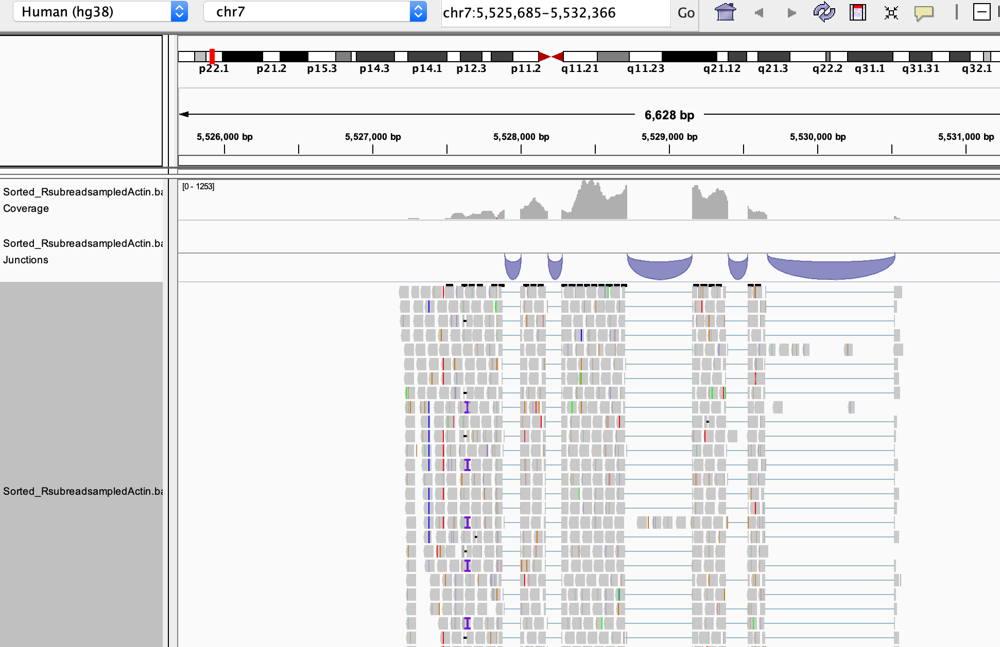

```{r setup, include=FALSE}
knitr::opts_chunk$set(echo = TRUE)
AsSlides <- TRUE
```

```{r setup2, include=FALSE,eval=FALSE,echo=FALSE}
library(ShortRead)
temp <- readFastq("~/Projects/Results/RNAseqPipeTest/FirstTest/FQs/ENCFF000CXH.fastq.gz")

~/Downloads/out.fq
temp <- readFastq("~/Downloads/out.fq")
tAlin <- temp[sample(1:length(temp),10000)]
writeFastq(tAlin,"~/Downloads/sampledActin.fq.gz")
BiocInstaller::biocLite("QuasR")
myFile <- data.frame(FileName="data/sampled_ENCFF000CXH.fastq.gz",SampleName="ENCFF000CXH")
library("BSgenome.Hsapiens.UCSC.hg19")
tis <- BSgenome.Hsapiens.UCSC.hg19[["chr5"]]
writeXStringSet(DNAStringSet(list(chr5=tis)),"chr5.fa")
write.table(myFile,"samples.txt",sep="\t",row.names=FALSE,quote=FALSE)
qAlign("samples.txt","chr5.fa")
library(Rsamtools)
Rsamtools::sortBam("data/sampled_ENCFF000CXH_29a7bd074f7.bam","Sorted_sampled_ENCFF000CXH")
Rsamtools::indexBam("Sorted_sampled_ENCFF000CXH.bam")
myCoverage <- coverage("Sorted_sampled_ENCFF000CXH.bam")
export.bw(myCoverage,con = "Sorted_sampled_ENCFF000CXH.bw")

Rsamtools::indexBam("~/Downloads/ENCFF846QSN.bam")

myFile <- data.frame(FileName="~/Downloads/sampledActin.fq.gz",SampleName="ENCFF000CXH")
library("BSgenome.Hsapiens.UCSC.hg19")
tis <- BSgenome.Hsapiens.UCSC.hg19[["chr7"]]
writeXStringSet(DNAStringSet(list(chr7=tis)),"chr7.fa")
write.table(myFile,"samples.txt",sep="\t",row.names=FALSE,quote=FALSE)
qAlign("samples.txt","chr7.fa",splicedAlignment = TRUE)
library(Rsamtools)
Rsamtools::sortBam("~/Downloads/sampledActin_29a70b5f1d3.bam","sampledActinSpliced")
Rsamtools::indexBam("sampledActinSpliced.bam")
myCoverage <- coverage("Sorted_sampled_ENCFF000CXH.bam")
export.bw(myCoverage,con = "Sorted_sampled_ENCFF000CXH.bw")

Rsamtools::indexBam("~/Downloads/ENCFF846QSN.bam")

```

```{r,results='asis',include=TRUE,echo=FALSE}
if(params$isSlides == "yes"){
  cat("
class: inverse, center, middle

# Alignment

<html><div style='float:left'></div><hr color='#EB811B' size=1px width=720px></html> 

---
"    
  )
}else{
  cat("

# Alignment

---
"    
  )
  
}
```

## Alignment - Fasta and fastq

In previous sessions we have seen how to handle unaligned sequence data as well as where and how to retrieve genome reference data in Fasta format. 

.pull-left[
<div align="center">

</div>
  ]

.pull-right[
<div align="center">

</div>
  ]

---
## Aligned data - SAM/BAM

We will want to produce a SAM/BAM file containing aligned reads in a format we can visualise in IGV and work with in our downstream analysis.


<div align="center">

</div>

---
## Alignment softwares

We now need a suitable **aligner** software to place unaligned reads onto our reference genome to produce a SAM/BAM file.

Aligner softwares can be broadly placed into two categories.

* Genomic aligner (WGS, ChIP-seq, ATAC-seq etc).
* Splice Aware aligner (RNA-seq, Ribo-seq).

Popular genomic aligners include **Bowtie**, **bwa**, **subread**,**GMAP**.

Popular splice aware aligners include **hisat2**,**Tophat**, **SpliceMap**, **subjunc**, **GSNAP**, **STAR**.

---

## Splice alignment

A splice aware aligner is important for analysis of RNAseq where mRNA's introns are spliced to stitch exons into continuous sequence.


<div align="center">

</div>


---

## Alignment software in R

A few of the popular aligners are wrapped up in R/Bioconductor packages allowing us to use our **aligner** software from R as well as make use of some of the R/Bioconductor objects we are growing to love.

* Bowtie - **Rbowtie**, **Rbowtie2**, **QuasR**
* GSNAP/GMAP - **gmapR**
* SpliceMap - **QuasR**
* subread/subjunc - **rsubread**
* hisat2 - **Rhisat2**, **QuasR**
---

## Alignment software in R

The **gampR** packages offer convenient access to gmap/gsnap on Mac and Linux but sadly are not implemented on Windows.

The **QuasR** package offers an interface to Bowtie and SpliceMap on Windows, Mac and Linux and so provides access to a genomic and splice aware aligner on all systems.

The **Rbowtie2** package offers a wrapper to the popular Bowtie2 software and offers significant improvement in memory and CPU usage to Bowtie packaged in QuasR.

**rsubread** offers convenient access to subread/subjunc, and recently got expanded from Mac and Linux only, to also include Windows. We recommend rsubread for analysis.

---
## Data

In this session we will be making use of some public datasets from the Encode consortium.

We will be using raw sequence reads in fastQ format which have been generated from an RNAseq experiment.

This RNAseq data has been generated from the human cell line **GM12878** and the link to experiment can be found [here](https://www.encodeproject.org/experiments/ENCSR297UBP/) or a direct link to FastQ for replicate 2 we are using can be found [here.](https://www.encodeproject.org/files/ENCFF000CXH/@@download/ENCFF000CXH.fastq.gz)

---

## Data

To speed up the processing for this practical I have retrieved aligned data from Encode for the sample **ENCSR297UBP** and extracted reads mapping to ActB gene on hg20 human genome build. I have further downsampled these reads to only 10000 reads out of the 200000 mapping to this gene.

This sampled data can be found in **data/sampledActin.fq.gz**


---
## The Rsubread package

The Rsubread package offers a fast aligner for both genomic and splice aware alignment.

Updated refrequently - [Latest paper here](https://academic.oup.com/nar/article/47/8/e47/5345150)


```{r sum2wcww, echo=TRUE,eval=FALSE,include=TRUE}
BiocManager::install('Rsubread')
library(Rsubread)
```

```{r sum2wcwwa, echo=FALSE,eval=TRUE,include=FALSE}
suppressPackageStartupMessages(library(Rsubread))
```

---
## BSGenome packages

We will also require some reference data so lets install the BSgenome package for hg38.

```{r load11, echo=TRUE,eval=FALSE}
BiocManager::install("BSgenome.Hsapiens.UCSC.hg38")
library(BSgenome.Hsapiens.UCSC.hg38)
```

```{r load1, echo=FALSE,eval=TRUE}
suppressPackageStartupMessages(library(BSgenome.Hsapiens.UCSC.hg38))
```

---
## Write out FASTA

To build an index for mapping we need our reference sequence in FASTA format. 

Lets extract a FASTA file from out BSgenome object. Here we will create a FASTA file for just Chr7 (the location of ActB)

```{r bsgenomeffft, echo=TRUE,eval=FALSE}
chr7hg38 <- BSgenome.Hsapiens.UCSC.hg38[["chr7"]]
chr7hg38Set <- DNAStringSet(list(chr7=chr7hg38))
writeXStringSet(chr7hg38Set,file="chr7.fa")
```

---
## Building an index

The Rsubread package requires we first build an index of our reference genome. This is what we will align our Fastq files to. 

Here we use the **buildindex()** function, specifying the name of index to be built and the FASTA file to build the index from.  

By default the memory (RAM) used when building an index is limited to 8GB. This is often too large for your laptop. You can dial this down using the memory argument. 

This may take some time but you will only need to run this index step once.

```{r sum2wcwssw, echo=TRUE,eval=FALSE,include=TRUE}
buildindex("chr7","chr7.fa", memory=8000)
```

---
## Aligning

We can now use the **align()** function to align reads to the genome.

We must specify out index name, fastq file, desired output format and name of BAM file to be created.

```{r sum2waacww, echo=TRUE,eval=FALSE,include=TRUE}
align("chr7","data/sampledActin.fq.gz",
        output_format = "BAM",
        output_file = "data/Rsubread_NoSplicing_sampledActin.bam")
```

---
## Aligned data in BAM 

Now we have our aligned data as BAM formats we must perform two final operations on our BAM to make it ready for use in external programs.

These are:

* Sorting (here by coordinate)
* Indexing

---
## Rsamtools

The **samtools** software provide command line tools to handle SAM and BAM files such as indexing and sorting.

The **Rsamtools** package allows us to make us of the samtools functions within R.

First we can install and load the library.

```{r loadq, echo=TRUE,eval=FALSE}

BiocManager::install("Rsamtools")
library(Rsamtools)
```

```{r loadq1, echo=FALSE,eval=TRUE}
suppressPackageStartupMessages(library(Rsamtools))
```

---
## Rsamtools sorting

We can use the **Rsamtools** function **sortBam()** to sort our BAM file. 

The  **sortBam()** function take as arguments the path to BAM file to sort and the **prefix** of sorted BAM output.

Note the **prefix** should not contain the *.bam* extension.

```{r sort, echo=TRUE,eval=TRUE}
sortBam("data/Rsubread_NoSplicing_sampledActin.bam","SortedActB")
```

---
## Rsamtools sorting

After sorting, we can now index our sorted BAM file using the **indexBAM()** function.

```{r index, echo=TRUE,eval=TRUE}
indexBam("SortedActB.bam")
```

---
## Rsamtools BAM overview

We can get an overview of BAM file information using the **quickBamFlagSummary()** function.

```{r sum, echo=TRUE,eval=TRUE,collapse=TRUE}
quickBamFlagSummary("SortedActB.bam")
```

---
## Review in IGV

We can now review our BAM file in IGV.

<div align="center">

</div>

---
## Review in IGV

But if we look for splice junctions we see we are missing some information.

<div align="center">

</div>

---
## Splice aware aligning

We are missing reads which would align across splice junctions. We can now use the **subjunc()** function to align reads in a splice aware manner.

We must again specify out index name, fastq file, desired output format and name of BAM file to be created.


```{r sum2wkaacww, echo=TRUE,eval=FALSE,include=TRUE}
subjunc("chr7","data/sampledActin.fq.gz",
        output_format = "BAM",
        output_file = "data/RsubreadsampledActin.bam")
```

---
## Sort and index our file

We can now sort and index our splice aware alignment as before.

```{r sum2wcaww, echo=TRUE,eval=T,include=TRUE}
sortBam("data/RsubreadsampledActin.bam",
        "SortedActBSpliced")
indexBam("SortedActBSpliced.bam")
```

---
## Rsamtools BAM overview

We can get an overview of BAM file information using the **quickBamFlagSummary()** function.

```{r sum2, echo=TRUE,eval=TRUE,collapse=TRUE}
quickBamFlagSummary("SortedActBSpliced.bam")
```

---
## Review in IGV

We can now review our splice aware BAM file in IGV.

<div align="center">

</div>

---
## Review in IGV

Now if we compare to the original alignment from Encode we can identify where some of our unaligned reads may have gone.

<div align="center">

</div>

---
## Review in IGV

The default parameters for alignment within aligners are carefully selected for alignment with ChIP-seq, ATAC-seq, WGS and splice aware alignment in RNA-seq. We will review this performance over the coming sessions.

An example here shows alignment with STAR, which often allows for very long splicing. Here you can see reads map over the neighbouring gene to an unrelated region.

<div align="center">

</div>

```{r sum2ww, echo=FALSE,eval=FALSE,collapse=TRUE,include=FALSE}
temp <- scanBam("SortedActBSpliced.bam")
reads <- temp[[1]]$qname[is.na(temp[[1]]$mapq)]
temp2 <- readGAlignments("~/Downloads/out.bam",param=ScanBamParam(what=c("qname", "strand", "pos", "qwidth")))
temp3 <- temp2[temp2@elementMetadata$qname %in% reads]
export(temp3,"missing.bam")


library(Rsubread)
Rsubread::buildindex("chr7","chr7.fa",gappedIndex = FALSE,indexSplit = FALSE)
Rsubread::subjunc("/Users/tcarroll/Projects/Software/Github/RUBioconductor_Introduction/r_course/presentations/slides/chr7","/Users/tcarroll/Projects/Software/Github/RUBioconductor_Introduction/r_course/data/sampledActin.fq.gz",output_format = "BAM",output_file = "/Users/tcarroll/Projects/Software/Github/RUBioconductor_Introduction/r_course/data/RsubreadsampledActin.bam")

temp <- scanBam("data/RsubreadsampledActin.bam")
reads <- temp[[1]]$qname[is.na(temp[[1]]$mapq)]
temp2 <- readGAlignments("~/Downloads/out.bam",param=ScanBamParam(what=c("qname", "strand", "pos", "qwidth")))
temp3 <- temp2[temp2@elementMetadata$qname %in% reads]
export(temp3,"missingRsubread.bam")

qAlign("sampleTable.txt","chr7.fa",splicedAlignment = TRUE,maxHits = 100)

```


---
## The Rbowtie2 package

The **Rbowtie2** library offers an alternative genomic alignment in R using Bowtie2.

```{r loadbw2, echo=TRUE,eval=FALSE}

BiocManager::install("Rbowtie2")
library(Rbowtie2)
```

```{r loadbw2_, echo=FALSE,eval=TRUE}
suppressPackageStartupMessages(library(Rbowtie2))
```

---
## The Rbowtie2 package

As we saw with **rsubread** we first need to build an index to align too. We can build the index using the **bowtie2_build** function supplying the path to Fasta file to **references** argument and path for bowtie2 index to **bt2Index** command. 

Again, this may take some time but you will only need to run this index step once.


```{r sumww2wvvcdhywwss, echo=TRUE,eval=FALSE,include=TRUE,tidy=FALSE}
bowtie2_build(references="chr7.fa", 
                       bt2Index=file.path("chr7hg38"))
```

---
## The Rbowtie2 package

Now we have created an index to align to, we can align our fastq data to this index. 

First however we will need to decompress our compressed fastq files to use them with Rbowtie2. The **gunzip** function in R allows us to decompress file from R.


```{r sumww2zzzzwcwwsslkkass, echo=TRUE,eval=FALSE,include=TRUE,tidy=FALSE}
library(R.utils)

gunzip("data/sampledActin.fq.gz")
```

---
## The Rbowtie2 package

We can align our data using the main **bowtie2** function and specifying the index path to  **bt2Index** argument, the output path for sam to **samOutput** argument and the sequence we wish to align to the **seq1** path.


```{r sumww2wxxcwwsslkkass, echo=TRUE,eval=FALSE,include=TRUE,tidy=FALSE}
bowtie2(bt2Index = "chr7hg38",
          samOutput = "sampledActin.sam",
          seq1 = "data/sampledActin.fq")
```

---
## The Rbowtie2 package

The **bowtie2** function outputs a SAM file. We will want to produce a BAM file we can sort and index from this SAM file using the **asBam** function.


```{r sumww2zzwcwwsslkkass, echo=TRUE,eval=FALSE,include=TRUE,tidy=FALSE}
bamFile_Bowtie2 <- asBam("sampledActin.sam")
bamFile_Bowtie2
```

---
## The Rbowtie2 package

We can then sort and index our BAM file to ensure we are ready for IGV and downstream analysis.


```{r sumww2wcxxwwsslkkass, echo=TRUE,eval=FALSE,include=TRUE,tidy=FALSE}
sortBam(bamFile_Bowtie2,"SortedActBSpliced_bowtie")
indexBam("SortedActBSpliced_bowtie.bam")
```

---
## The Rbowtie2 package

Aligners have a variety of costs/benefits. **Rbowtie2** is a significant improvement the original **Bowtie**, but it is not splice aware alignment. It only allows for genomic alignment.

This means that **Rbowtie2** is suitable for 
- ATAC-seq 
- ChIP-seq
- WGS

**Rbowtie2** is NOT suitable for 
- RNA-seq
- Ribo-seq

---
## QuasR

Some wrappers have multiple aligners built in to them. 

This makes it easy to switch between options.

* Bowtie - **QuasR**
* SpliceMap - **QuasR**
* hisat2 - **QuasR**

---
## QuasR

```{r load, echo=TRUE,eval=FALSE}
BiocManager::install("QuasR")
library(QuasR)
```

```{r load1q, echo=FALSE,eval=TRUE}
suppressPackageStartupMessages(library(QuasR))
```

---
## QuasR genomic alignment

The main function for alignment in the QuasR package is the **qAlign()** function.

The **qAlign()** function requires just two arguments.

* A Samples file - Tab-delimited file containing fastq location and sample names.
* Reference genome - Character string of **BSgenome** object or FASTA file location.

---
## QuasR genomic alignment - Sample table

The sample table requires is a tab-delimited file listing the path to fastq(s) to be aligned and the desired sample names.

```{r sampleTable1, echo=TRUE,eval=FALSE}
FileName <- "data/sampledActin.fq.gz"
SampleName <- "sampledActin"
sampleTable <- data.frame(FileName,SampleName)
write.table(sampleTable,file="sampleTable.txt",sep="\t",quote=FALSE,row.names = FALSE)
```

```{r sampleTable1s, echo=FALSE,eval=TRUE}
FileName <- "data/sampledActin.fq.gz"
SampleName <- "sampledActin"
data.frame(FileName,SampleName)
```

---
## QuasR genomic with BSGenome object

The simplest way to specify a reference genome for alignment in **qAlign()** is to use a BSgenome object.

Here we can simply specify the name of BSgenome object we wish to use for alignment. Here we specify the BSgenome object for hg38 **BSgenome.Hsapiens.UCSC.hg38**.

```{r bsgenome, echo=TRUE,eval=FALSE}
library(QuasR)
qAlign("sampleTable.txt", "BSgenome.Hsapiens.UCSC.hg38")
```

---
## QuasR genomic with FASTA file

Internally, QuasR will create a FASTA file from our BSgenome object prior to alignment.

We can also provide a FASTA file directly to the **qAlign()** function.

```{r bsgenomek, echo=TRUE,eval=FALSE}
qAlign("sampleTable.txt","chr7.fa")
```

---
## Choosing aligner with QuasR 

The aligner argument is used to control which algorithm you were going to use. Here we use Rhisat2 as it is a good algorithm for mapping reads across splice junctions.

```{r bsgenomeka, echo=TRUE,eval=FALSE}
qAlign("sampleTable.txt","chr7.fa", aligner="Rhisat2")
```

---

## Time for an exercise.

[Link_to_exercises](../../exercises/exercises/alignment_exercise.html)

[Link_to_answers](../../exercises/answers/alignment_answers.html)


