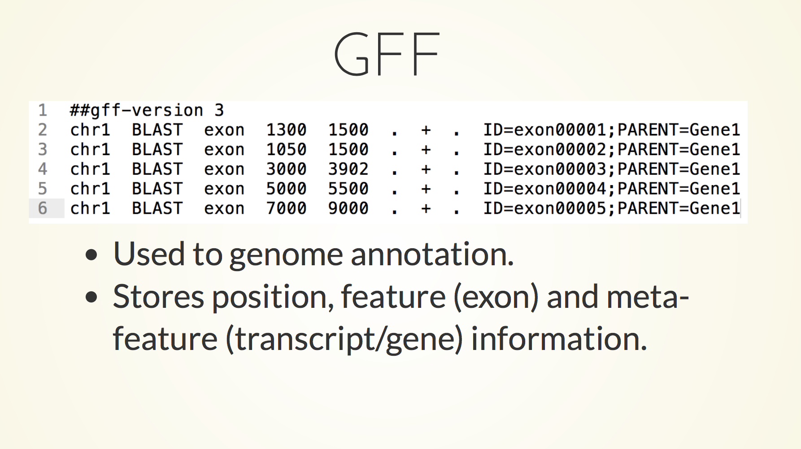
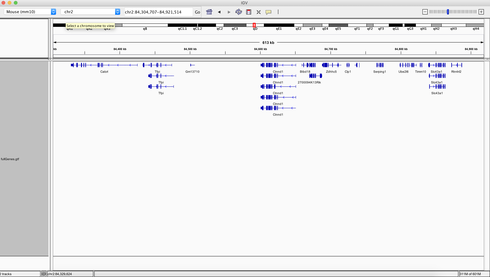
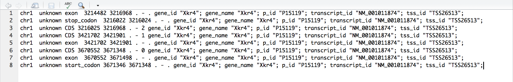
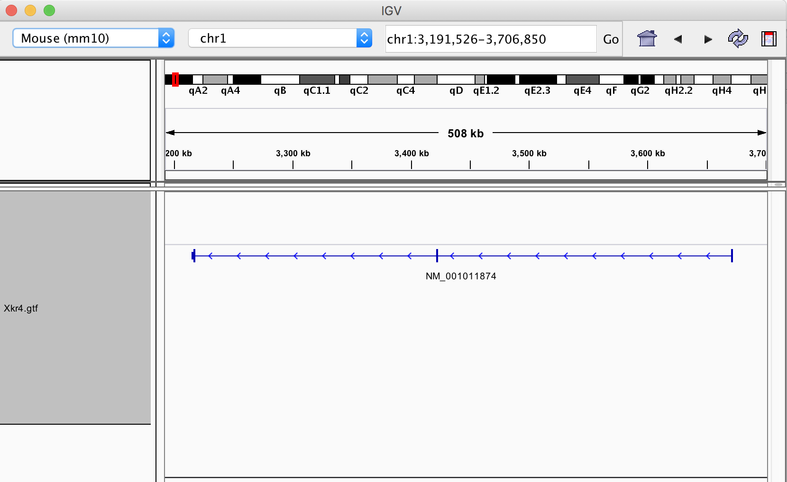
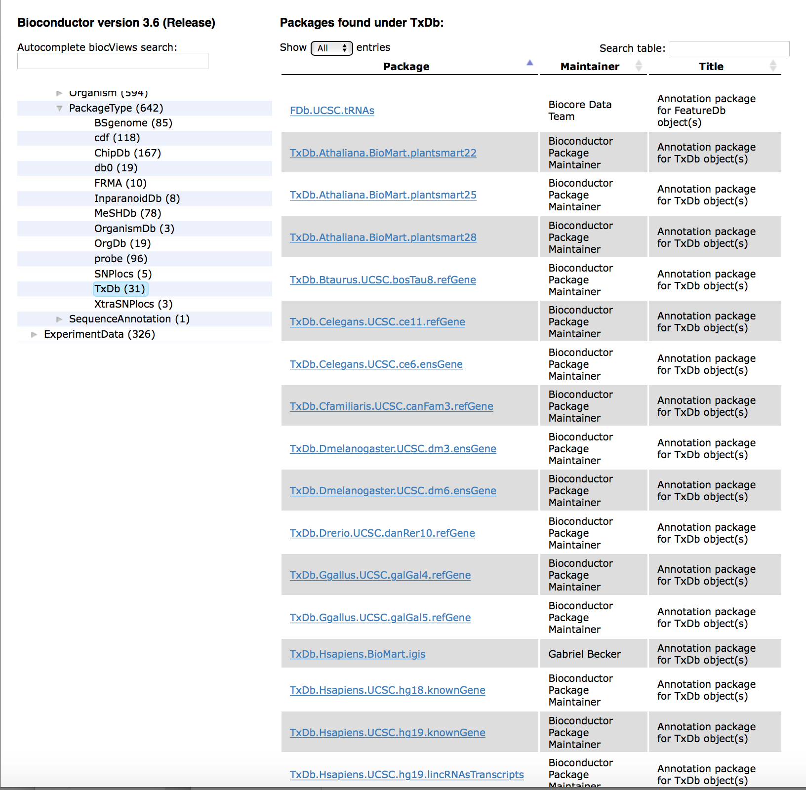
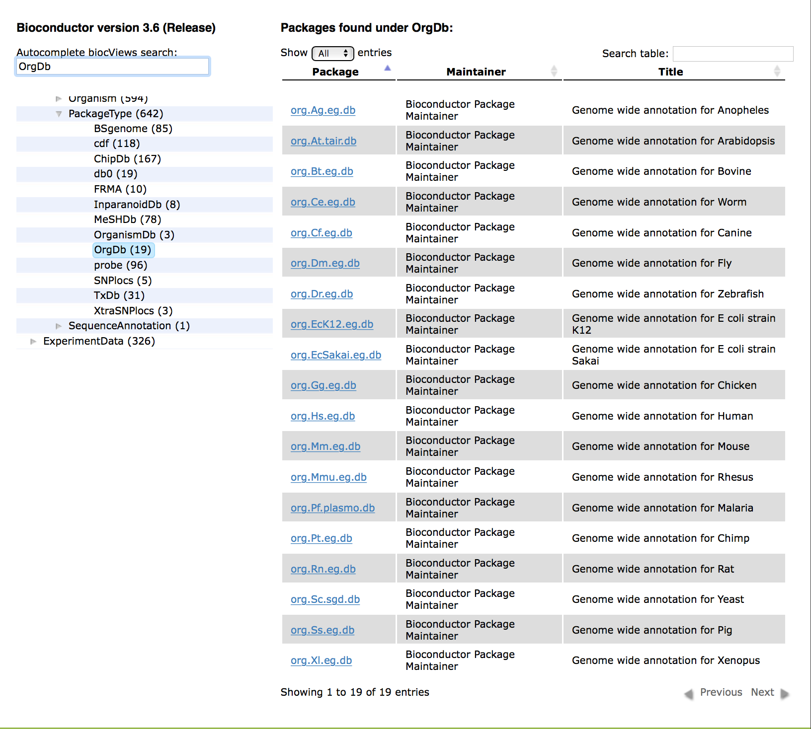

```{r setup, include=FALSE}
knitr::opts_chunk$set(echo = TRUE)
AsSlides <- TRUE
```


```{r,results='asis',include=TRUE,echo=FALSE}
if(params$isSlides == "yes"){
  cat("---
class: inverse, center, middle

# Genomic Features

<html><div style='float:left'></div><hr color='#EB811B' size=1px width=720px></html> 

---
"    
  )
}else{
  cat("---

## Genomic Features

---
"    
  )
  
}
```


## Genomic Features

Genomic Features are often stored as GTF or GFF files.

<div align="center">

</div>

---
## Genes as Genomic Features

In particular, we often find gene models as GFF or GTF files.

This importantly allows us to associate.

* Exons with transcripts.
* Transcripts with genes.

With this mapping we can perform complex operations such as summarising genome wide RNAseq signal to genes/transcripts expressions.  

---
## IGV and GFF/GTF

We use GFF and GTF in IGV to display gene models. 

```{r setssssup, eval=FALSE,echo=FALSE}
library(TxDb.Hsapiens.UCSC.hg19.knownGene)
export.gff(TxDb.Hsapiens.UCSC.hg19.knownGene,con = "data/test.gff")
```

<div align="center">

</div>

---
## A Single Gene Model in GTF Format

GTF is perhaps the most common format for gene models. 

In this example we have a GTF file containing a single gene model for the **Xkr4** gene.

This can be found in **data/Xkr4.gtf**

<div align="center">

</div>
---
## A Single Gene Model in IGV

IGV parses information from the GTF file to construct the gene model we see containing untranslated regions and directionality of expression.

<div align="center">

</div>

---
## Genomic Features in Bioconductor

In Bioconductor, gene models are prepackaged for us in the **TxDb** packages.

Format is TxDb. **species** . **source** . **major version** . **table**

Homo Sapiens gene build from UCSC's version hg19 known gene table - TxDb.Hsapiens.UCSC.hg19.knownGene

<div align="center">

</div>


---
## Genomic Features in Bioconductor

We can however make use of GTF/GFF files of our own gene models outside of Bioconductor pre-built TxDB packages.

The **GenomicFeatures** package has functions to import a GTF/GFF into a Bioconductor **TxDb** object as well as to interact with **TxDb** objects.

- [**GenomicFeatures**](https://bioconductor.org/packages/release/bioc/html/GenomicFeatures.html) - Import to and handling of **TxDB** objects in R.

---
## Genomic Features in Bioconductor

The first package we will look at is the **TxDB** package - **TxDb.Hsapiens.UCSC.hg19.knownGene**.

Remember we can install Bioconductor packages (fairly) easily  using Bioconductor package pages' provided commands. 

```{r setssssuxxp, eval=FALSE}
if (!requireNamespace("BiocManager", quietly = TRUE))
    install.packages("BiocManager")

BiocManager::install("TxDb.Hsapiens.UCSC.hg19.knownGene")
```

---
## Genomic Intervals in Bioconductor

Now we have the package installed, we can load the library.

```{r sedfs,eval=TRUE,echo=FALSE}
suppressPackageStartupMessages(library(TxDb.Hsapiens.UCSC.hg19.knownGene))
```

```{r ssaa,eval=FALSE}
library(TxDb.Hsapiens.UCSC.hg19.knownGene)
```

---
## TxDb

Once we have loaded the **TxDb.Hsapiens.UCSC.hg19.knownGene** library, we will have a new **TxDb** object available to us called **TxDb.Hsapiens.UCSC.hg19.knownGene**.

```{r sss,eval=TRUE}
class(TxDb.Hsapiens.UCSC.hg19.knownGene)
```
---
## TxDb

When this variable name is typed in into console we can retrieve some key information on the Gene Model build as well as summary metrics.

```{r sssk,eval=TRUE}
TxDb.Hsapiens.UCSC.hg19.knownGene
```

---
## Accessing Information

As suggested in the name, **TxDb** objects are a database containing information we would store in GTF/GFF files.

To access information in our **TxDb** object we will need to use special accessor functions.

These accessors return information in **GRanges'** formats allowing us to work with methods from the **GenomicRanges** packages.

---
# Extracting Genomic Locations

We have a number of functions which allow us to extract GRanges for our features of interest including:

* **genes()** - Extract gene locations as a **GRanges**.
* **transcripts()** - Extract transcript locations  as a **GRanges**.
* **exons()** - Extract exon locations  as a **GRanges**.
* **cds()** - Extract coding locations  as a **GRanges**.
* **promoters()** - Extract promoter locations  as a **GRanges**.


---
## Extracting Genes

We can extract genes with the **genes()** function and the **TxDb** object as a parameter.

```{r ssslkk,eval=TRUE}
myGenes <- genes(TxDb.Hsapiens.UCSC.hg19.knownGene)
myGenes
```
---
## Extracting Exons

We can extract exons with the **exons()** function and the **TxDb** object as a parameter in the same way.

```{r ssslkzassk1,eval=TRUE}
myExons <- exons(TxDb.Hsapiens.UCSC.hg19.knownGene)
myExons
```
---
## Extracting Transcripts

We can extract transcripts with the **transcripts()** functions and the **TxDb** object as a parameter.

```{r ssslkzaak1,eval=TRUE}
myTranscripts <- transcripts(TxDb.Hsapiens.UCSC.hg19.knownGene)
myTranscripts
```
---
## Extracting Coding Regions

We can extract coding regions with the **cds()** functions and the **TxDb** object as a parameter.

```{r ssslkzak1z,eval=TRUE}
myCDS <- cds(TxDb.Hsapiens.UCSC.hg19.knownGene)
myCDS
```

---
## Extracting Additional Information

We can control which additional information such as transcript ID and gene ID we retrieve in metadata columns using the **columns** parameter in the **exons()/transcripts()/cds()** functions. 

For a full list of available columns see **?transcripts()** function help.

```{r ssslkzzk,eval=TRUE}
myTranscripts <- transcripts(TxDb.Hsapiens.UCSC.hg19.knownGene, 
                             columns=c("gene_id","tx_id"))
myTranscripts[1:2]
```

---
## Extracting Promoter Regions

Another useful function is the **promoters()** function.

This accepts additional parameters of **upstream** and **downstream** to specify regions around TSS to be used as a promoter while accounting for a transcripts's strand.

We have been using the **resize()** function with **GRanges** objects for the same purpose.

```{r ssslfdkzzkjj,eval=TRUE}
myPromoters <- promoters(TxDb.Hsapiens.UCSC.hg19.knownGene, 
                             upstream=2000,downstream=50)
myPromoters[1:2]
```

---
## Extracting Groups of Genomic Features

A major component of gene models in GFF and GTF files is the grouping of exons to transcripts/genes and transcripts to genes.

We can extract lists of GRanges (a GRangesList) containing the grouping of features to metafeatures using additional accessor functions.

These include the **transcriptsBy()**, **exonsBy()** and **cdsBy()**.


---
## Extracting Groups of Genomic Features

The **transcriptsBy()** function takes as argument a **TxDb** object and a **by** argument specifying the metafeature/feature to group by.

For the **transcriptsBy()**, the **by** argument may be gene, exon or cds.

```{r ssslkzzzjzkjj,eval=TRUE}
transcriptByGenes <- transcriptsBy(TxDb.Hsapiens.UCSC.hg19.knownGene, 
                                   by="gene")
transcriptByGenes[1:2]
```

---
## Extracting Groups of Genomic Features

As with all lists we can extract information from elements in the GRangesList using the **$** and **[[]]** accessors.

This will extract the grouped intervals as a GRanges.

```{r ssslkzzszzkjj,eval=TRUE}
# transcriptByGenes$1 or
transcriptByGenes[[1]]
```

---
## Extracting Groups of Genomic Features

Similarly the very useful **exonsBy()** function takes again an argument for a **TxDb** object and a **by** argument.

For the **exonsBy()** and **cdsBy()** functions, the **by** argument may be gene, or transcript.

```{r ssslkzzzzfkjj,eval=TRUE}
exonsByTranscript <- exonsBy(TxDb.Hsapiens.UCSC.hg19.knownGene, 
                                   by="tx")
exonsByTranscript[1:2]
```


---
## Creating TxDb from External Sources

Often we will have our favourite gene models stored in a GTF outside of Bioconductor objects. If we wish to take advantage of all the features in Bioconductor we will need to import it into a **TxDb** object.

We can do this using the **makeTxDbFromGFF()** function which will parse GTF or GFF into a **TxDb** object
```{r ssslkzzzzfkkjkjj,eval=TRUE}
myCustomTxDb <- makeTxDbFromGFF("data/Xkr4.gtf")
class(myCustomTxDb)
```

---
## Creating TxDb from External Sources
```{r ssslkzzzzfkaakjkjaj,eval=TRUE}
myCustomTxDb
```

---
## Creating TxDb from External Sources

Now we have our own custom GTF object we can make use of the functions from **GenomicFeatures** package such as retrieving gene coordinates as a **GRanges**.

```{r sssleekzzzzfkjj,eval=TRUE}
genes(myCustomTxDb)
```
---
## Creating TxDb from External Sources

Or exons grouped by genes as a **GRangesList**.


```{r ssaaslkzzzzfkjj,eval=TRUE}
exonsBy(myCustomTxDb,by="gene")
```
---
## Creating TxDb from UCSC

We can create a TxDb directly from UCSC's database using the **makeTxDbFromUCSC()** function.

The **makeTxDbFromUCSC** function simply requires a genome name to build a **TxDb** object. 

We can review the genomes available to us using the **ucscGenomes()** function from the **rtracklayer** package. This returns a data frame of genomes from which we can build a TxDB object.


```{r skuysslkzzzzfkjj,eval=TRUE}
library(rtracklayer)
availableGenomes <- ucscGenomes()
availableGenomes[1:4,]
```
---
## Creating TxDb from UCSC

Once we have identified the genome build we wish to use we can specify the genome parameter in the **makeTxDbFromUCSC()** function.

```{r ssslkzzzzfkssjj,eval=TRUE,cache=FALSE,message=FALSE}
hg18TxDb <- makeTxDbFromUCSC(genome="hg18")
hg18TxDb
```
---
## Creating TxDb from UCSC

And again we can now make use of **GenomicFeatures** package's functions with our new TxDb objects

```{r ssslkzzzzddfkjj,eval=TRUE,cache=TRUE,message=FALSE,warning=FALSE}
hg18Promoters <- promoters(hg18TxDb,2000,50)
```
---
## Exporting a TxDb Object as GTF/GFF File

We can make use of the **export.gff()** in the **rtracklayer** package to export our **TxDb** object to a gtf or gff file. We can include an additional argument of **format** to the **export.gff()** function.

We can specify the **format** to be **gff** or **gtf** as shown below.

```{r ssslkzzzzdddsdsfkjj,eval=TRUE,cache=TRUE,message=FALSE,warning=FALSE}
export.gff(myCustomTxDb,con="customTxDbb.gff",format="gff")
export.gff(myCustomTxDb,con="customTxDbb.gtf",format="gtf")
```
---
## Useful Functions in GenomicFeatures

We have seen that we can extract transcripts and exons grouped by their genes/transcripts using the **transcriptsBy()** and **exonsBy()** functions.

To identify the total number of groups we can simply use the **length()** function. Here we have 23459 transcipts or groups of exons.

```{r ssslkzzzzsdsddfkjj,eval=TRUE,cache=TRUE,message=FALSE,warning=FALSE}
transcriptByGenes <- exonsBy(hg18TxDb,by="gene")
length(transcriptByGenes)
```
---
## Useful Functions in GenomicFeatures

To find the number of exons in every group/transcript we can use the function **lengths()**. The **lengths()** function will tell us the length of every group in our **GRangesList**

```{r ssslkzzzzddcccfkjj,eval=TRUE,cache=TRUE,message=FALSE,warning=FALSE}
transcriptNumberPerGene <- lengths(transcriptByGenes)
transcriptNumberPerGene[1:5]
```
---
## Useful Functions in GenomicFeatures

We may wish to know the total sum length of all exons in every transcript. The **transcriptLengths()** function allows us to find all transcript lengths from a TxDb object as well as additional information.

```{r ssslkzzxxzssszddfkjj,eval=TRUE,cache=TRUE,message=FALSE,warning=FALSE}
transcript_Lens <- transcriptLengths(hg18TxDb)
transcript_Lens[1:5,]
```
---
## Extracting Sequence Information

As with many Bioconductor packages, there is interoperability between **BSgenome** packages holding genome sequences and **TxDb** objects with gene models. One very useful function is the **extractTranscriptSeqs()** function.

The **extractTranscriptSeqs()** accepts a BSgenome object of genomic sequence of interest and a TxDb object.

```{r ssslkzzzzddsddfkjj,eval=TRUE,cache=TRUE,message=FALSE,warning=FALSE}
library(BSgenome.Hsapiens.UCSC.hg19)
hg19TransSeq <- extractTranscriptSeqs(BSgenome.Hsapiens.UCSC.hg19, 
                                      transcripts=TxDb.Hsapiens.UCSC.hg19.knownGene)
hg19TransSeq
```
---
## Extracting Sequence Information

We can then either work with the resulting DNAStringSet then in R or write to Fasta file for analysis in external programs.

```{r ssslkdszzzzddfkjj,eval=TRUE,cache=TRUE,message=FALSE,warning=FALSE}
writeXStringSet(hg19TransSeq,"myTranscriptSequences.fa")
```

---
## Changing Naming Conventions

So far we have used the standard UCSC style of chromosome names

- Chr1, Chr2, Chr3 ..

Sadly, conventions for chromosome and contig names can vary across different annotation sources.

Ensembl for instance uses.

- 1, 2, 3, 4 ...

---
## Changing Chromosome Naming Styles

The **GenomeInfoDb** package and associated **GenomeInfoDbData** package contain mappings between differing naming conventions and functions to convert between them.

First we need to load the **GenomeInfoDb** library.

```{r}
library(GenomeInfoDb)
```

---
## Reviewing Chromosome Naming Styles

We can review all the mappings for supported organisms' genomes using the **genomeStyles()** function with no arguments.

The **genomeStyles()** function returns a list of mapping data.frames of each organism.

```{r}
allMappings <- genomeStyles()
names(allMappings)
```

---
## Chromosome Naming Style

We can then review mappings for our organism of interest's genomes by retrieving the relevant entry from our list returned by the **genomeStyles()** function.

The resulting data.frame contains information on contig/chromosome mappings as well as additional information on chromosomes, i.e. Circularity. 

```{r}
#allMappings$Homo_sapiens or
allMappings[["Homo_sapiens"]]
```

---
## Changing Chromosome Naming Styles

The **seqlevelsStyle()** function allows us to review as well as set the naming convention for our GenomicRanges or TxDb objects.

First lets review the genes from the  **TxDb.Hsapiens.UCSC.hg19.knownGene** package. Here we see they are **UCSC** style.

```{r}
myGenes <- genes(TxDb.Hsapiens.UCSC.hg19.knownGene)
seqlevelsStyle(myGenes)
myGenes[1:2,]

```

---
## Changing Chromosome Naming Styles

Now we can update them to **Ensembl**, **NCBI** or **dbSNP** styles. Here we update to **Ensembl** chromosome naming conventions. 

This conversion is essential if we want to use our objects with data generated following Ensembl styles.

```{r}
seqlevelsStyle(myGenes) <- "Ensembl"
myGenes[1:2,]

```


---
## Gene Annotation

Where as the **TxDb** packages hold information on gene models such as exons positions and exon to gene mapping, the **OrgDb** packages contain information on gene's mapping to alternative IDs and any functional annotation. 

Information on model organism's gene annotation is contained with the **org.db** packages.

Format is org. **species** . **ID type** .db

Homo Sapiens annotation with Entrez Gene IDs -- org.Hs.eg.db

<div align="center">

</div>

---
## Gene Annotation

To gain access to gene annotation we must first load the library for the relevant species.

Here we install and load the library for Human, Org.Hs.eg.db.


```{r ssslkdszzzdsdzddfkjjsds,eval=FALSE,echo=TRUE,cache=TRUE,message=FALSE,warning=FALSE}
BiocManager::install("org.Hs.eg.db")
library(org.Hs.eg.db)
class(org.Hs.eg.db)
```

```{r ssslkdszzsdzzddfkjjsds,eval=TRUE,echo=FALSE,cache=FALSE,message=FALSE,warning=FALSE}
suppressPackageStartupMessages(library(org.Hs.eg.db))
class(org.Hs.eg.db)
```

---
## Org.db AnnotationDbi Accessor Functions

As with the TxDb packages, we will need to use special accessors to retrieve information from Org.db.

We can use the functions:

- **columns()** - Display what kind of annotation is available in OrgDb objects.
- **keytypes()** - Displays which type of identifiers can be used with **select** function. 
- **keys()** - Returns keys (index) for the database contained in the OrgDb object. Used along with **keytypes()** in <b>select</b> function to retrieve interested annotation
- **select** - Retrieve the annotation data as a data.frame based on the supplied keys, keytypes and columns. 

We will explore how to retrieve annotation from gene-centric organism level annotation package (org.Hs.eg.db) using these functions.

---
## Accessing Annotation from Org.Db

We can use the **columns()** function first to list available annotation.

Here we see our annotation for alternative IDs (ENSEMBL, REFSEQ, GENENAME) as well as functional annotation (GO, PATH, OMIM)

```{r, echo=TRUE, eval=TRUE}
columns(org.Hs.eg.db)
```
--
To know more about the above identifier types
```{r, echo=TRUE, eval=TRUE}
help(GENENAME)
```
---
## Accessing Annotation from org.Hs.eg.db

Which keytypes can be used to query this database can be retrieved using keytypes.
```{r, echo=TRUE, eval=TRUE}
keytypes(org.Hs.eg.db)
```
---

## Accessing Annotation from Org.Db

If we want to extract few identifiers of a particular keytype, we can use keys() function
```{r, echo=TRUE, eval=TRUE}
keys(org.Hs.eg.db, keytype="SYMBOL")[1:10]
```
---
## Accessing Annotation from Org.Db

We can extract other annotations for a particular identifier using <b>select</b> function
```{r, echo=TRUE, eval=TRUE,message=FALSE,warning=FALSE}
select(org.Hs.eg.db, keys = "A1BG", keytype = "SYMBOL", 
       columns = c("SYMBOL", "GENENAME", "CHR") )
```

---
## Annotating Results

We can use this now to translate our Entrez IDs from TxDb object to a gene name
```{r sqsq, echo=TRUE, eval=TRUE, dependson="ssslkzzzzfkssjj"}
geneLocations <- genes(hg18TxDb)
geneLocations
```

---
## Annotating Results

```{r sqsaq, echo=TRUE, eval=TRUE, dependson="ssslkzzzzfkssjj",message=FALSE,warning=FALSE}
IDs <- geneLocations$gene_id
myTable <- select(org.Hs.eg.db, keys = IDs, keytype = "ENTREZID",
                  columns = c("SYMBOL", "GENENAME", "ENTREZID") )
myTable[1:2,]

```
---

## Time for an Exercise

[Link_to_exercises](../../exercises/exercises/GenomicFeatures_exercises.html)

[Link_to_answers](../../exercises/answers/GenomicFeatures_answers.html)

