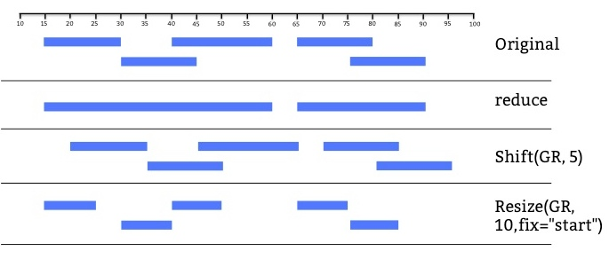

```{r setup, include=FALSE}
knitr::opts_chunk$set(echo = TRUE)
AsSlides <- TRUE
```


```{r,results='asis',include=TRUE,echo=FALSE}
if(params$isSlides == "yes"){
  cat("---
class: inverse, center, middle

# Genomic Intervals

<html><div style='float:left'></div><hr color='#EB811B' size=1px width=720px></html> 

---
"    
  )
}else{
  cat("---

## Genomic Intervals

---
"    
  )
  
}
```


### Genomic Intervals examples.

In Genomics and High throughput sequencing we make extensive use of Genomic Intervals to store simple annotation and summarised results over regions.

- Transcriptional Start Sites / Enhancers
- Enrichment for ChIP-seq signal. i.e. Peak calls.


---
### Genomic Intervals manipulation

We also want to be able to assess spatial relation between such genomic intervals within our linear genome. 

- Transcriptional Start Sites and their nearest enhancers.
- Enrichment for ChIP-seq signal within promoters and outside of promoters.


```{r,results='asis',include=TRUE,echo=FALSE}
if(params$isSlides == "yes"){
  cat("---
class: inverse, center, middle

# Genomic Intervals in Bioconductor.

<html><div style='float:left'></div><hr color='#EB811B' size=1px width=720px></html> 

---
"    
  )
}else{
  cat("---

## Genomic Intervals in Bioconductor.

---
"    
  )
  
}
```


### Genomic Intervals in Bioconductor.

Two popular Bioconductor packages for dealing with Genomics Intervals are:

- [**rtracklayer**](https://bioconductor.org/packages/release/bioc/html/rtracklayer.html) -- Importing/exporting genomic intervals into/out of R.
- [**GenomicRanges**](https://bioconductor.org/packages/release/bioc/html/GenomicRanges.html) -- Handling genomic intervals in R.

---
### Genomic Intervals in Bioconductor.

The first package we will look at is the GenomicRanges package.

Remember we can install Bioconductor packages (fairly) easily  using Bioconductor package pages' provided commands.

```{r setssssup, eval=FALSE}
## try http:// if https:// URLs are not supported
source("https://bioconductor.org/biocLite.R")
biocLite("GenomicRanges")
```

---
### Genomic Intervals in Bioconductor.

Now we have the package installed, we can load the library

```{r sedfs,eval=TRUE,echo=FALSE}
suppressPackageStartupMessages(library(GenomicRanges))
```

```{r ss,eval=FALSE}
library(GenomicRanges)
```


```{r,results='asis',include=TRUE,echo=FALSE}
if(params$isSlides == "yes"){
  cat("---
class: inverse, center, middle

# Creating Genomic Ranges.

<html><div style='float:left'></div><hr color='#EB811B' size=1px width=720px></html> 

---
"    
  )
}else{
  cat("---

## Creating Genomic Ranges.

---
"    
  )
  
}
```


### Building a GenomicRanges.

To construct a GenomicRanges object we require a set of genomic intervals.

Intervals (genomic and non genomic intervals) are created using the **IRanges()** function. We must specify **start** and **end** positions as numeric vectors to create our IRanges object.

```{r sttsss}
myIntervals <- IRanges(start=c(1,10,20),end=c(2,11,30))
class(myIntervals)
```

---

### Building a GenomicRanges.

The resulting IRanges object contains our intervals and an additional column describing widths of intervals.


```{r sttxxxsx}
myIntervals
```

---

### Building a GenomicRanges.

Now to create a Genomic Ranges interval object , **GRanges** object,we extend this to include chrosomosome/contig information. 

To do this we can supply our new IRanges object and a vector of corresponding chromosome locations to the **seqnames** parameter in **GRanges()** function.


```{r sttxxsjjx}
myGenomicIntervals <- GRanges(seqnames=c("chr1","chr1","chr2"),
                              myIntervals)
class(myGenomicIntervals)
```

---

### Building a GenomicRanges.

The created **GRanges** object contains our original intervals from the IRanges object and now the chromosomes/contigs on which there intervals exist.


```{r stxxtsdx}
myGenomicIntervals
```

---
### Indexing and subsetting a GenomicRanges.

We can retrieve genomic intervals from our GRanges using indexing as with [vectors, matrices and dataframes.](https://rockefelleruniversity.github.io/Intro_To_R_1Day/r_course/presentations/slides/introToR_Session1.html#/21)

```{r sttsxxx}
myGenomicIntervals[c(2,3),]
```

---

### Indexing and subsetting a GenomicRanges.

Unlike data frames and matrices, we dont need the second **","** to specify rows not columns.

```{r stxxtsx}
myGenomicIntervals[c(2,3)]
```

---
### Accessing columns in  GenomicRanges.

To access the columns of a GRanges object we must use special accessor functions - **seqnames()**,**start()**, **end()** which correspond to the columns we wish to retrieve.

We get start and stop positions using the  **start()** and **end()** functions.

```{r stddxxtsxss}
start(myGenomicIntervals)
```

```{r stddxxtssss}
end(myGenomicIntervals)
```

---

### Replacing in columns of  GenomicRanges.

We can use the **start()** and **end()** functions to update our start and end positions as well.

```{r stddxxtsxssss}
start(myGenomicIntervals) <- c(1,5,15)
```

```{r stddxxtsxssds}
start(myGenomicIntervals)
```

---

### Replacing in columns of  GenomicRanges.

We can not however create intervals with negative widths. Our start positions cannot be greater than our end positions.

```{r stddxxtsxssssddss,error=TRUE}
start(myGenomicIntervals) <- c(10,50,150)
```
---
### retrieving chromosome/contig names from a GenomicRanges.

We can retrieve the chromosome names in a similar manner to **start()** and **end()** functions using the **seqnames()** function.

```{r stddxxtsxdddsssddss,error=TRUE}
contigNames <- seqnames(myGenomicIntervals)
contigNames
```
---
### retrieving chromosome/contig names from a GenomicRanges.

The contig names are stored in another special object called a RLE (run length encoded).
This RLE object saves memory and allows for more efficient manipulation of long stretchs of repeated names.

We can convert to a character vector using the **as.character()** function

```{r stddaaxxtsxssddss,error=TRUE}
as.character(contigNames)
```
---

### Replacing chromosome/contig names from a GenomicRanges.

As with the **start()** and **end()** functions we can update our contig names using the **seqnames()** function.


```{r stddssxxtsxssddss,error=TRUE}
seqnames(myGenomicIntervals) <- c("chr2","chr2","chr1")
seqnames(myGenomicIntervals)
```
---
### Replacing chromosome/contig names from a GenomicRanges.

As with [all factors however](https://rockefelleruniversity.github.io/Intro_To_R_1Day/r_course/presentations/slides/introToR_Session1.html#/57), we can not add contigs not already in use in seqnames column.


```{r stddxxaadtsxassddddss,error=TRUE}
seqnames(myGenomicIntervals) <- c("chr3","chr2","chr1")
```
---
### Replacing chromosome/contig names from a GenomicRanges.

To add new contig we must update the seqlevels, like levels for factors but now for contigs in GRanges objects.

The **seqlevels()** identifies which contigs we are using.
```{r stddxxddstsxsddsddss,error=TRUE}
seqlevels(myGenomicIntervals)
```
---
### Replacing chromosome/contig names from a GenomicRanges.

We can update the seqlevels in use by again using the **seqlevels()** function.
```{r stddxxssdtsxsddsddss,error=TRUE}
seqlevels(myGenomicIntervals) <- c("chr1","chr2","chr3")
seqlevels(myGenomicIntervals)
```
---
### Replacing chromosome/contig names from a GenomicRanges.

Now we can add contig for chromosome 3 (**chr3**).
```{r stddxxddwwstsxsddsddss,error=TRUE}
seqnames(myGenomicIntervals) <- c("chr1","chr2","chr3")
myGenomicIntervals
```
---
### Strand information in a GenomicRanges.

We can include strand information in GRanges objects.

We can set strand to be "+" , "-" , or unstranded with "*"
```{r aaeroe,error=TRUE}

myGenomicIntervals <- GRanges(seqnames=c("chr1","chr1","chr2"), 
                              myIntervals,
                              strand=c("+","-","*"))
myGenomicIntervals
```
---
### Strand information in a GenomicRanges.

Similarly we can extract and set strand information using the **strand()** function.
```{r atra,error=TRUE}

strand(myGenomicIntervals) <- c("+","+","-")
strand(myGenomicIntervals)
```
---
### Strand information in a GenomicRanges.

Although an factor RLE, strand always contains the levels "+", "-", "*" and only these levels.

```{r aera,error=TRUE}

myGenomicIntervals <- GRanges(seqnames=c("chr1","chr1","chr2"),
                              myIntervals,
                              strand=c("+","+","+"))
strand(myGenomicIntervals)
```
---

### Names in a GenomicRanges.

Finally we can set and extract names for our genomic intervals using the **names()** function.

```{r aaaq,error=TRUE}
names(myGenomicIntervals) <- c("peak1","peak2","peak3")
myGenomicIntervals
```
---

### Names in a GenomicRanges.

As with vectors we can use to names to index and retrieve genomic intervals of interest.

```{r afffa,error=TRUE}
myGenomicIntervals["peak2"]
```
---

### Additional genomic interval information.

We will often want to store more information on our genomic intervals. We can use the **mcols** (metadata columns) to store this information
To add additional metadata columns we can simply supply the desired column name and the values we want to the **GRanges()** function as with data.frames.

```{r asa,error=TRUE}
myIntervals <- IRanges(start=c(1,2,2),end=c(2,11,30))
myGenomicIntervals <- GRanges(seqnames=c("chr1","chr1","chr2"),
                              myIntervals,strand=c("+","+","+"),
                              Score=c(10,20,40),
                              Comment=c("GoodQC","GoodQC","BadQC"))

```

---
### Additional genomic interval information.

We can retrieve this metadata column information as with data frames by using the **$** accessor

```{r aasaaaa,error=TRUE}
myGenomicIntervals$Score
myGenomicIntervals$Comment
```

---
### Additional genomic interval information.

We to retrieve all metadata columns as a data frames we can use the **mcols()** function

```{r aasaaa,error=TRUE}
mcols(myGenomicIntervals)
```


---
### Convert to data frame.

We can convert the entire GRanges to a data.frame using the **as.data.frame()** function.

```{r aaszzzzzaaaaa,error=TRUE}
as.data.frame(myGenomicIntervals)
```

---
### GRanges from IDs.

The GenomicRanges package also as a quick short cut to create GRanges from character strings. 

We simply specify a genomic range as we saw presented in IGV - **Chromosome:Start-End** _**(chr1:110-120)**_.

```{r aaszzzzzaaadsdaa,error=TRUE}
GRanges("chr1:110-120")
```

---
### GRanges from IDs.

Often genomics programs will export results in table with a similar format for the GenomicIntervals. The BRC pipeline outputs in a format of **Chromosome:Start:End** _**(chr1:110:120)**_ to allow separation into columns in programs such as excel. 

We will need to replace last **":"** with a **"-"** so we can use the **stringi** package's **stri_replace_last_fixed** function. 

```{r aaszzzzzaxaaaaaca,error=TRUE}
library(stringi)
myRange <- "chr1:110:120"
newRange <- stri_replace_last_fixed(myRange, ':', '-')
newRange
GRanges(newRange)
```

---
### GRanges from IDs.

Sometimes the format is  **IDforRange:Chromosome:Start:End**. We can clean this up in additional step using another **stringi** function.

```{r aaszzzzzaaassaca,error=TRUE}
library(stringi)
myRange <- "MyID:chr1:110:120"
newRange <- stri_replace_last_fixed(myRange, ':', '-')
newerRange <- stri_replace_first_regex(newRange, '\\w*:', '')
GRanges(newerRange)
```

---
### Special Genomic Ranges functions

One of the big advantage of using GRanges objects to handle genomic data is the set of functions which allows us to manipulate and handle genomic intervals.

The include functions to resize, merge/reduce and shift genomic ranges.


---
### Adjusting genomic ranges positions.

To adjust the postion of a GRanges object we can manually adjust start and end positions but GenomicRanges provides some more user friendly methods.

The **shift** function allows us to move by a specified number of basepairs.

```{r aaaskjbvasa,error=TRUE}
myGenomicIntervals[1]
shift(myGenomicIntervals[1],shift = 10)
```

---
### Adjusting genomic ranges positions.

The **resize()** function allows to adjust the width of regions.

```{r aaasatcsa,error=TRUE}
myGenomicIntervals[3]
resize(myGenomicIntervals[3],width=20)
```

---
### Adjusting genomic ranges positions.

By default the **resize()** function adjust the width of regions from the **start** of the region. We can control this behaviour by specifying the **fix** parameter as **start**, **end** or **centre** to specify where we wish to resize from.

```{r aaasdasalpi,error=TRUE}
myGenomicIntervals[3]
resize(myGenomicIntervals[3],width=20, fix="end")
```

---

### Adjusting genomic ranges positions.

The **resize()** function by default takes into account strand information. 

For negative strand intervals, when specifying **fix=start** it considers the start as the end position. i.e. Useful for Gene positions.


```{r aaasakjsfvrfa,error=TRUE}
resize(myGenomicIntervals[3],width=20, fix="start")
strand(myGenomicIntervals)[3] <- "-"
resize(myGenomicIntervals[3],width=20, fix="start")
```

---
### Adjusting genomic ranges positions.

A final function for adjusting genomic ranges which we will review is the **reduce()** function. 

The reduce function merges overlapping regions into a single genomic interval.


First lets make some overlapping intervals

```{r ajfddkkmsa,error=TRUE}
myGenomicIntervals <- GRanges(seqnames=c("chr1","chr1","chr2"),
                              ranges=IRanges(start=c(1,2,2),end=c(2,11,30)),
                              strand=c("+","+","+"))
myGenomicIntervals
```
---
### Adjusting genomic ranges positions.

Now we can merge them with **reduce()** function taking into account chromosomes

```{r ajfddslka,error=TRUE}
mergedGenomicIntervals <- reduce(myGenomicIntervals)
mergedGenomicIntervals
```
---
### Adjusting genomic ranges positions.

The **reduce()** function also takes into account the strand information and only merges genomic intervals on same strand.

```{r ajfddujlsa,error=TRUE}
strand(myGenomicIntervals) <- c("+","-","+")
mergedGenomicIntervals <- reduce(myGenomicIntervals)
mergedGenomicIntervals
```
---
### Adjusting genomic ranges positions.

We can merge intervals across strands by setting **ignore.strand=TRUE**. Note that all regions are now considered strandless.

```{r ajfddusxjihlsa,error=TRUE}
strand(myGenomicIntervals) <- c("+","-","+")
mergedGenomicIntervals <- reduce(myGenomicIntervals,
                                 ignore.strand=TRUE)
mergedGenomicIntervals
```

---

### Overlapping genomic intervals

Some particularly useful methods/operators in GenomicRanges allows us to assess the relationship between two sets of GRanges objects.

One of the most common is the **%over%** operator which allows us to identify overlapping regions.

First we make two GRanges objects.

```{r ajfddfucfdjlsa,error=TRUE}
myGenomicIntervals1 <- GRanges(seqnames=c("chr1","chr1"),
                              ranges=IRanges(start=c(1,25),
                                             end=c(20,30)),
                              strand=c("+","+"))
myGenomicIntervals2 <- GRanges(seqnames=c("chr1","chr1"),
                              ranges=IRanges(start=c(22,100),
                                             end=c(27,130)),
                              strand=c("+","+"))
```

---

### Overlapping genomic intervals

```{r ajfddfuhjlsa,error=TRUE}
myGenomicIntervals1
myGenomicIntervals2
```

---

### Overlapping genomic intervals
Now to find all regions in **myGenomicIntervals1** which overlap with intervals in **myGenomicIntervals2** we simply use the **%over%** operator.

This will return a logical vector specifying if regions in **myGenomicIntervals1** overlap any regions in **myGenomicIntervals2**.

```{r ajfddfuhjcfvlsa,error=TRUE}
myGenomicIntervals1 %over% myGenomicIntervals2
```

---

### Overlapping genomic intervals

We can use this logical vector then to subset our **myGenomicIntervals1** set [as we have with vectors](https://rockefelleruniversity.github.io/Intro_To_R_1Day/r_course/presentations/slides/introToR_Session1.html#/31) .

```{r ajfdcfdfuhjlsa,error=TRUE}
myGenomicIntervals1[myGenomicIntervals1 %over% myGenomicIntervals2]
```

---

### Overlapping genomic intervals

Another useful function to find overlaps is the **findOverlaps()** function.

This returns a new object **Hits** object.


```{r dccdc,error=TRUE}
myOverlaps <- findOverlaps(myGenomicIntervals1,myGenomicIntervals2)
class(myOverlaps)
```

---

### Overlapping genomic intervals

To extract the indicies of genomic intervals in **myGenomicIntervals1** overlapping **myGenomicIntervals2** we can use the **queryHits()** function. 

To get the corresponding indicies of overlapping **myGenomicIntervals2** regions we can use the **subjectHits()** function.


```{r cdkkcdcdc,error=TRUE}
queryHits(myOverlaps)
subjectHits(myOverlaps)
```

---

### Overlapping genomic intervals

We can use these indicies to retrieve the overlapping intervals.

```{r rekkpkvre,error=TRUE}
myGenomicIntervals1[queryHits(myOverlaps)]
myGenomicIntervals2[subjectHits(myOverlaps)]
```

---

### Finding closest regions.

Another common set of operations we often want to perform between our Genomic Intervals is to find regions which are nearest to, precede or follow each other.

We can perform these actions using the **nearest**, **precede** and **follow** functions.

```{r ajfddfusscdcscfdjlsa,error=TRUE}
myGenomicIntervals1 <- GRanges(seqnames=c("chr1","chr1"),
                              ranges=IRanges(start=c(10,20),
                                             end=c(25,30)),
                              strand=c("+","+"))
myGenomicIntervals2 <- GRanges(seqnames=c("chr1","chr1"),
                              ranges=IRanges(start=c(1,10000),
                                             end=c(2,10002)),
                              strand=c("+","+"))

```

---

### Finding closest regions.

```{r ajfddfussscfdxcscsjlsa,error=TRUE}
myGenomicIntervals1
myGenomicIntervals2
```

---

### Nearest genomics intervals

The **nearest()** function accepts the two GenomicRanges we wish to compare as arguments and returns the index of intervals in second GenomicRanges nearest to those in first GenomicRanges.

```{r ajfddfussseecrfdjlsa,error=TRUE}
indexOfNearest <- nearest(myGenomicIntervals1,myGenomicIntervals2)
indexOfNearest
```

---

### Nearest genomics intervals

I can use this vector of index positions to then extract intervals in second GenomicRanges nearest to those in first GenomicRanges

```{r ajfddfussscrssfdjlsa,error=TRUE}
myGenomicIntervals2[indexOfNearest]

```

---
### Preceding and following genomics intervals

We can use the **precede()** and **follow()** functions in much the same way to the **nearest()** function. This returns the index of elements in second GenomicRanges argument that are preceeded or followed by elements in first GenomicRanges argument

```{r ajfddfussscrfdjlecdsa,error=TRUE}
precedeIndex <- precede(myGenomicIntervals1,myGenomicIntervals2)
followIndex <- follow(myGenomicIntervals1,myGenomicIntervals2)
myGenomicIntervals2[precedeIndex]
```

---
### Distance To Nearest genomics intervals

Another useful function is **distanceToNearest()** which again accepts arguments like **nearest()** or **findOverlaps()** functions and provides an object containing indexes of nearest intervals including a column of distances between nearest intervals.

```{r ajfddfussscscscrfdjlsa,error=TRUE}
distances <- distanceToNearest(myGenomicIntervals1,myGenomicIntervals2)
distances
mcols(distances)
```

---
### Importing and exporting to bed.

As we have seen, Genomic Intervals are often stores as BED files. 

The **rtracklayer** package provide mechanisms to import and export from BED3/6 files using the **import.bed** and **export.bed** functions.

```{r revruujje,error=TRUE}
library(rtracklayer)
mySicerPeaks <- import.bed(con="Data/SicerPeaks.bed")
mySicerPeaks
```
---
### Importing and exporting to bed.

Exporting to BED is achieved by using the **export.bed()** function.

This produces a valid BED file for use in IGV and other softwares.

```{r revkkjkre,error=TRUE}
export.bed(mySicerPeaks, con="moreSicerPeaks.bed")
```

---
### Using GRanges to extract sequences.

We saw how we can extract sequences from a BSgenome object previously using **subseq()** function.

```{r revkdedkjkaare,echo=FALSE}
suppressPackageStartupMessages(library(BSgenome.Mmusculus.UCSC.mm10))
```


```{r revkdedkjkre,error=TRUE}
library(BSgenome.Mmusculus.UCSC.mm10)
subseq(BSgenome.Mmusculus.UCSC.mm10$chr10,1,100)
```
---
### Using GRanges to extract sequences.

With GRanges objects we can specify the BSgenome for the sequence and GRanges as regions to be extracted.

Here we can use the **getSeq()** function to extract sequences under our Sicer Peaks on the mm10 genome. 


```{r revkvfydedkjkre,error=TRUE}

sicerSeq <- getSeq(BSgenome.Mmusculus.UCSC.mm10,names=mySicerPeaks)
sicerSeq
```
---
### Using GRanges to extract sequences.

The resulting **DNAStringSet** may be written to a FASTA file for further analysis in external programs
```{r revkdedkjkkkre,error=TRUE}
writeXStringSet(sicerSeq,"sicerSeq.fa")
```

---
### Time for an exercise.

[Link_to_exercises](../../exercises/GI_exercises.html)

[Link_to_answers](../../answers/GI_answers.html)


