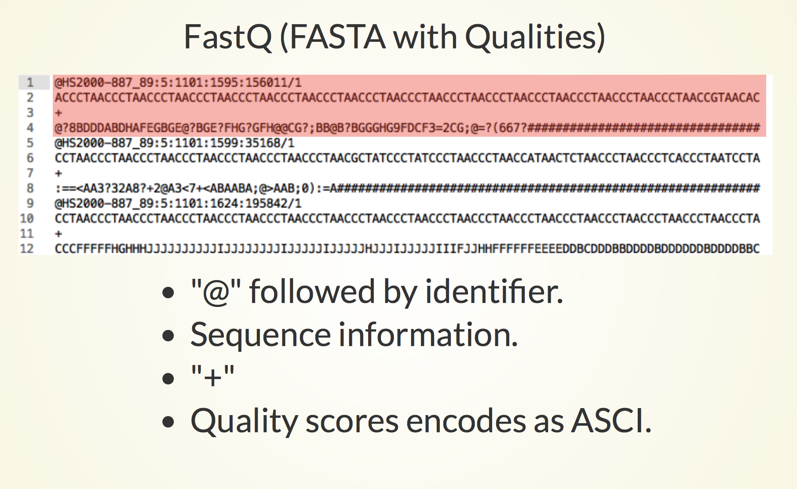

```{r setup, include=FALSE}
knitr::opts_chunk$set(echo = TRUE)
AsSlides <- TRUE
```

```{r setup2, include=FALSE,eval=FALSE,echo=FALSE}
library(ShortRead)
temp <- readFastq("~/Projects/Results/RNAseqPipeTest/FirstTest/FQs/ENCFF000CXH.fastq.gz")
fastqSample <- temp[1:100000]
writeFastq(fastqSample,file = "~/Projects/Software/Github/RUBioconductor_Introduction/r_course/Data/sampled_ENCFF000CXH.fastq.gz",mode = "w")
```

# FastQ Sequences

As we have seen earlier,sequences returned from the Illumina sequences machines are often stored in FASTQ format.

<div align="center">

</div>


---

# FastQ in Bioconductor.

Illumina sequences as FastQ files can be handled in Bioconductor using the functions in the **Biostrings** package as well as the **ShortRead** package.

---

# ShortRead packages.

To make use of a ShortRead package we must first install and load the library.

```{r load, echo=TRUE,eval=FALSE}
source("https://bioconductor.org/biocLite.R")
biocLite("ShortRead")
```

```{r load1, echo=FALSE,eval=TRUE}
suppressPackageStartupMessages(library(ShortRead))
```

---

# Data

In this session we will be making use of some public datasets from the Encode consortium.

We will be using raw sequence reads in fastQ format which have been generated from an RNAseq experiment.

This RNAseq data has been generated from the human cell line **GM12878** and the link to experiment can be found [here](https://www.encodeproject.org/experiments/ENCSR297UBP/) or a direct link to FastQ for replicate 2 we are using can be found [here.](https://www.encodeproject.org/files/ENCFF000CXH/@@download/ENCFF000CXH.fastq.gz)


---

# Data locally

For this session, i have taken the first 100,000 reads from the fastQ file **ENCFF000CXH.fastq.gz** to create **Data/sampled_ENCFF000CXH.fastq.gz**. This should allow us to quickly perform some processing and analysis of this data as well as include the smaller file size example data in our zip archive.

This can be found in 

**Data/sampled_ENCFF000CXH.fastq.gz**


---

# Data locally

Even though we will work with smaller sample for the presentation, the ShortRead allows us to handle large sequencing datasets in a memory efficient manner.

We will review this at the end of the session.


---

# Reading in FastQ data

The **ShortRead** package allows us to import FastQ files into R using the **readFastq()** function. This function returns a **ShortReadQ** storing the information from the fastQ file (sequence, quality of sequence and unique read identifiers).

```{r setup2112,eval=TRUE,echo=TRUE}
library(ShortRead)
fastQ <- readFastq("../../Data/sampled_ENCFF000CXH.fastq.gz")
class(fastQ)
```

---

# FastQ data object

We can get a very simple summary of the **ShortReadQ** object by typing in the variable name.
```{r setup22}
fastQ
```

---
# FastQ data object

We can use the familiar **length()** function to report the total number of reads as we have done for vectors or GRanges objects.

```{r setup23}
length(fastQ)
```


---
# FastQ data object

Or we can use the **width()** function to find the size of each read/sequence in fastQ as we have done with DNAstringSet and GRanges objects

```{r setup2q3}
readLengths <- width(fastQ)
readLengths[1:10]
```

---
# FastQ data object

We can subset or index **ShortReadQ** objects using the same methods as we have for vectors and GRanges.

Here i use a vector, e.g. 1:10 or c(1,2,3,4,5,6,7,8,9,10), to retrieve first 10 reads in file.
```{r setup2q3a}
fastQ[1:10]
```

---
# FastQ accessors

As we have seen, just typing the object name provide a summary of total reads and maximum read length but to retrieve information such a the sequence, quality or ID we will need to use some special accessors.

* **sread()** - Retrieve sequence of reads.
* **quality()** - Retrieve quality of reads as ASCI scores.
* **ids()** - Retrieve IDs of reads.
---
# FastQ sequences

We can retrieve all read sequences using the **sread()** accessor function and the **ShortReadQ** object.

```{r setup231zzw}
sequenceOfReads <- sread(fastQ)
class(sequenceOfReads)
```
---
# FastQ sequences

The sequences in reads are themselves held in an object we are quite familiar with, a **DNAStringSet** object.

```{r setup231ccw3drr}
sequenceOfReads 
```
---
# FastQ sequences

This means we can use all the great functions from the **Biostrings** library on this **DNAStringSet** object.

Here we get the occurrence of nucleotide bases in reads. Here we get the alphabet frequency of the first two.

```{r setup231w3dddrr}
alpFreq <- alphabetFrequency(sequenceOfReads)
alpFreq[1:2,]
```

---
# FastQ IDs

We can also extract the IDs for every read using the **id()** function.

The function again returns an object from the **Biostrings** packages, here the more generic **BStringSet** object.

```{r setup23ew2E}
idsOfReads <- id(fastQ)
class(idsOfReads)
idsOfReads[1:2]
```
---
# FastQ IDs

Again we can act on the **BStringSet** object just as we did on **DNAStringSet** objects.

Here we simply convert the **BStringSet** to a character vector with the **as.character()** function.

```{r setup23dd3re}
Ids <- as.character(idsOfReads)
Ids[1:4]
```

---
# FastQ Quality

A fundamental difference betweem Fasta and FastQ files is the **Q**uality scores containined in FastQ.

As we have seen, quality scores are stored as ASCI characters representing -log10 probability of base being wrong (Larger scores would be associated to more confident base calls.)

A comprehensive description of phred quality can be found on the wiki page for [FastQ](https://en.wikipedia.org/wiki/FASTQ_format#Quality)

---
# FastQ Quality

We can also extract the qualities for every read using the **quality()** function.

The returned object is a special extension of **BStringSet** object, the **FastqQuality** object

```{r setup23s3wwdre}
quals <- quality(fastQ)
class(quals)
```

---
# FastQ Quality

The object itself contains our quality scores as characters in ASCI format.

```{r setup23s3reed}
quals
```

---
# FastQ Quality

We can find out how to translate from these ASCI characters into their corresponding -log10 pvalues using the **encoding()** function on our **FastqQuality** object of qualities.

```{r setup23we4}
qualityEncoding <- encoding(quals)
qualityEncoding
```
---
# FastQ Quality

We could use our named vector of quality encoding to translate our **FastqQuality** object into qualities one read at a time.

We can subset the **FastqQuality** object using standard vector indexing using **[**.

We can extract a **BString** object using list indexing **[[**
```{r setup23sswejjdccd4}
quals[1]
quals[[1]]
```
---
# FastQ Quality

We can use the **strsplit()** to split out quality into an array of individual ASCI quality score and use the quality encoding to translate to -log10 pvalues. 

The **strsplit()** function takes a character vector to split and a character vector to split by. Here we split by nothing **""** to give us a vector of individual characters.

```{r setup23sswedccdfds4}
toTranslateList <- strsplit(as.character(quals[[1]]),"")
toTranslate <- unlist(toTranslateList)
toTranslate
```
---
# FastQ Quality

And finally we can translate vector of characters to scores using the named vector of quality encoding.

```{r setup23sswedcqcjjd4}
qualityEncoding[toTranslate]
```

---
# FastQ Quality

Thankfully, there are some functions available in the **ShortRead** package which will perform this translation for us.

We can obtain the sum -log10 pvalues using the **alphabetScore()** function for all reads.

```{r setup23sswedccjjwwd4}
readScores<- alphabetScore(quals)
readScores[1]
sum(qualityEncoding[toTranslate])
```
---
# FastQ Quality

We can also obtain the quality scores over cycles for all reads using the function **as(_myQualities_,"matrix")**


```{r setup23sswesqdccjjwwd4}
matrixOfQualities <- as(quals,"matrix")
rowSums(matrixOfQualities)[1]
```

---
# ShortRead functions.

The **ShortRead** package has many functions available to allow us to collect useful metrics from our ShortRead object.

One very useful function is the **alphabetByCycle()** function which provides a quick method to summarise base occurrence of cycles.

Here we apply **alphabetByCycle()** function to the sequence information and show the occurrence of main 4 bases over first 15 cycles.

```{r setup23sswessdccrrjjd4}
alpByCyc <- alphabetByCycle(sequenceOfReads)
alpByCyc[1:4,1:15]
```
---
# ShortRead functions.

We can also apply our new  **alphabetByCycle()** function to the quality scores. 

```{r setup23sswedccraarjjd4}
qualsByCyc <- alphabetByCycle(quals)
qualsByCyc[1:4,1:15]
```
---
# ShortRead functions.

We can use the **table** function to identify the number of times a sequence appears in our FastQ file's sequence reads.
```{r setup23sswedccrssrjjd4,eval=FALSE,echo=TRUE}
readOccurence <- table(sequenceOfReads)
sort(readOccurence,decreasing = TRUE)[1:2]
```

```{r setup23sswedccrssrdjjd4,eval=TRUE,echo=FALSE}
readOccurence <- table(sequenceOfReads)
data.frame(Occurrence=sort(readOccurence,decreasing = TRUE)[1:2])
```

---
# ShortRead functions.

We can identify duplicated reads (potentially arising from PCR over amplification) by using the **srduplicated()** function and the **ShortReadQ** object.

This returns a logical vector identifying which reads' sequences are duplicates (occur more than once in file). Note that the first time a sequence appears in file is not a duplicate but the second, third, fourth times etc are.

```{r setup23sswedsqccrrjjd4}
duplicates <- srduplicated(fastQ)
duplicates[1:3]
```
---
# ShortRead functions.

We can use this now to get a quick measure of sequence duplication rate using the **table** function.

```{r setup23sswedcwdcrrjjd4}
table(duplicates)
```

---
# ShortReads' qa function

The **ShortRead** package also contains a function to generate a simple quality control report.

The **qa()** function accepts a FastQ file and returns a **FastqQA**  object.

```{r setup2355}
myQA <- qa("../../Data/sampled_ENCFF000CXH.fastq.gz")
myQA
```
---
# ShortReads' qa function

We can then use the **report()** function to generate a simple report.

```{r setup236}
myReport <- report(myQA)
myReport
```
---
# ShortReads' qa function

Finally we can review the report in a browser or use the browseURL function to open it in a browser from R. 
```{r setup23q7,eval=FALSE}
browseURL(myReport)
```


---
# Trimming

When we observe low quality at the end of reads we may wish to remove the low quality bases for later alignment to the genome.
The **trimTails()** function trims reads from the 3', removing bases which fall below a desired quality. 
The **trimTails()** function accepts arguments specifying the **ShortReadQ** object, the minimum number of successive bases required to be below quality cut-off for trimming and the actual cut-off score. 

```{r setup2ee37}
TrimmedFastq <- trimTails(fastQ,20,"5")
TrimmedFastq
```

---
# Exporting Fastq files.

Now we have trimmed our FastQ reads, we can export these reads for further analysis using the **writeFastq()** function.

```{r setup237ede,eval=FALSE}
writeFastq(TrimmedFastq,"myTrimmed_Fastq.fastq.gz")
```

```{r setup23kk7ede,echo=FALSE}
unlink("myTrimmed_Fastq.fastq.gz")
writeFastq(TrimmedFastq,"myTrimmed_Fastq.fastq.gz",mode="w")
```


---
# Handling large files

So far we have used a subsampled FastQ file to review some of the functions available to us in the ShortRead package.

The **FastqSampler()** and **FastqStreamer()** functions allow us to read portions of a FastQ file. 
---
# Handling large files

For evaluating quality of our FastQ, we do not require the entire file but perhaps only 100,000 random reads to assess quality.

The **FastqSampler()** function allows us to specifiy how many reads we wish to sample when reading in a file. The **FastqSampler()** function returns a FastqSampler object we can use with **yield()** function to obtain a sample from


```{r setup237fef}
sampleToRead <- FastqSampler("../../Data/sampled_ENCFF000CXH.fastq.gz",
                             n=100)
yield(sampleToRead)
```

---
# Handling large files

The **FastqStreamer()** function works in a similar manner accept isntead of randomly sampling the file, it allows us to read chunks of the file at a time.

```{r setup23kk7ssa}
sampleToRead <- FastqStreamer("../../Data/sampled_ENCFF000CXH.fastq.gz",
                              n=100)
first100Reads <- yield(sampleToRead)
second100Reads <- yield(sampleToRead)
```
---

# Handling large files

We can stream over entire files using a loop, here in chunks of 25000


```{r setup2kk37}
f <- FastqStreamer("../../Data/sampled_ENCFF000CXH.fastq.gz",
                   n=25000)
while (length(fq <- yield(f)) > 0) {
    print(length(fq))
}
```


---

# Time for an exercise.

[Link_to_exercises](../../exercises/fastq_exercises.html)

[Link_to_answers](../../answers/fastq_answers.html)


