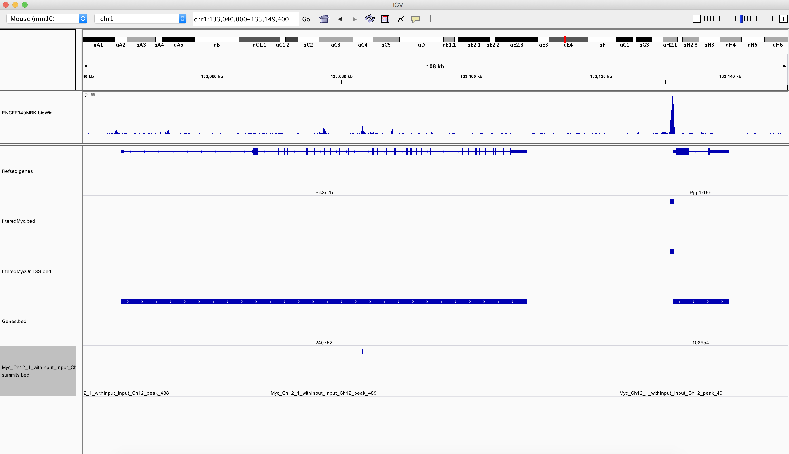
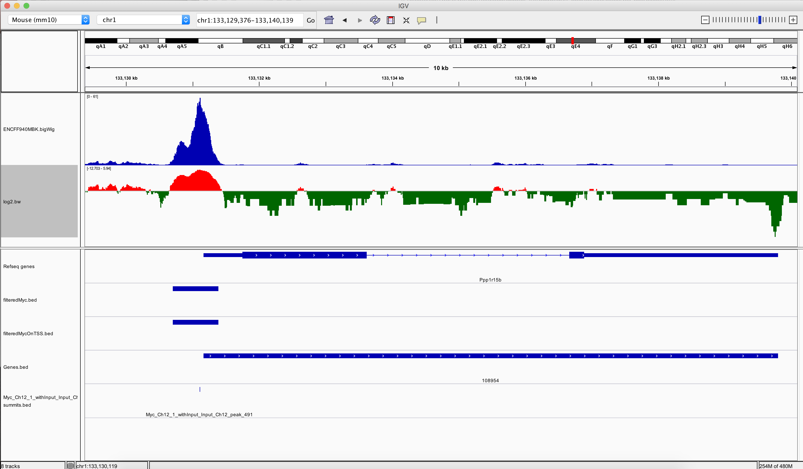

```{r setup, include=FALSE}
knitr::opts_chunk$set(echo = T,eval=T)
```


## Working with Genomic Scores

In this exercise we will work with some ChIP-seq data for the Encode experiment [**ENCSR000ERN**](https://www.encodeproject.org/experiments/ENCSR000ERN/).

1. Download the signal pvalue bigWig file for replicate 1 for this experiment.

This data can be found at the Encode experiment here or at the direct link [here](https://www.encodeproject.org/files/ENCFF940MBK/@@download/ENCFF940MBK.bigWig).

```{r installBS2z,echo=FALSE}
suppressPackageStartupMessages(library(rtracklayer))
suppressPackageStartupMessages(library(GenomicRanges))
```


2. Read in the bigWig signal for the region (chr1:133040000-133149400) as an RleList.


```{r e2}
library(rtracklayer)
regionToImport <- GRanges(seqnames="chr1",
                          ranges=IRanges(133040000,133149400))
mySelection <- BigWigSelection(regionToImport)
bigWigRegion <- import.bw("~/Downloads/ENCFF940MBK.bigWig",
                          selection=mySelection,
                          as="RleList")
```


3. Find the maximum and minimum of value of bigWig signal in the region.

```{r e2.2}
myMax <- max(bigWigRegion$chr1[133040000:133149400])
myMax <- max(bigWigRegion)["chr1"]
```

4. Produce an area plot (using geom_area) of the signal over the transcriptional start site (+/- 500bp of gene start) for the Ppp1r15b gene using ggplot2.

```{r e3}
TSSpos <- seq(133131166-500,133131166+500)
tssDF <- as.data.frame(bigWigRegion$chr1[TSSpos])
tssDF$position <- TSSpos
library(ggplot2)
ggplot(tssDF,aes(y=value,x=position))+geom_area()+theme_minimal()+xlab("Genome")+ylab("Score")+theme(axis.text.x = element_text(angle = 30, hjust = 1),axis.title.y = element_text(angle = 0))
```

4. Apply a log2 transformation to the genomic scores and save as a new variable.
```{r e4}
newBigWigRegion <- bigWigRegion
newBigWigRegion <- log2(newBigWigRegion)
```

5. Export this as bigWig and visualise signal over Ppp1r15b gene in IGV.
```{r e5}
export.bw(newBigWigRegion,"log2.bw")
```



6. Read in the file **data/Myc_Ch12_1_withInput_Input_Ch12_peaks.xls** and create a GRanges object of all peaks on chromosome 1.

```{r e6}
library(rtracklayer)
library(GenomicRanges)
MYCpeaks <- read.delim("data/Myc_Ch12_1_withInput_Input_Ch12_peaks.xls",sep="\t",comment.char = "#")
MYCgranges <- GRanges(MYCpeaks$chr,IRanges(MYCpeaks$start,MYCpeaks$end),
                       FE=MYCpeaks$fold_enrichment,
                       minuslog10Pval=MYCpeaks$X.log10.pvalue.)
MYCgrangesChr1 <- MYCgranges[seqnames(MYCgranges) %in% "chr1"]
```


7. Using this GRanges of Myc peaks, import in the Myc ChIPseq bigwig signal over the peaks on chromosome 1.
```{r es}
library(rtracklayer)
library(GenomicRanges)

mySelection <- BigWigSelection(MYCgrangesChr1)
bigWigPeaks <- import.bw("~/Downloads/ENCFF940MBK.bigWig",
                          selection=mySelection,
                          as="RleList")
```

8. Import the gene positions from mm10_GenePosForIGV.txt as a GRanges. Filter to genes on chromosome 1 and identify peaks overlapping the gene's promoter (here defined as a region ranging between 2000bp upstream from a gene's transcriptional start site to the transcriptional start site) and those not overlapping a promoter.


```{r instasssllBsssS2}
IGVGenePositions <- read.delim("data/mm10_GenePosForIGV.txt",sep="\t")

genePos <- GRanges(IGVGenePositions$seqnames,
                   IRanges(IGVGenePositions$start,IGVGenePositions$end),
                   strand = IGVGenePositions$strand)

names(genePos) <- IGVGenePositions$gene_id
tssPos <- resize(genePos,width = 1,fix = "start")
promoterPos <- resize(tssPos,width = 2000,fix = "end")

promoterPeaks <- MYCgrangesChr1[MYCgrangesChr1 %over% promoterPos]
nonPromoterPeaks <- MYCgrangesChr1[!MYCgrangesChr1 %over% promoterPos]
```


9. Create a violin plot of sum of bigWig signal within peaks at promoters and those not at promoters using ggplot2.

```{r eskd}

PeakCoveragePromoter <- bigWigPeaks[promoterPeaks]
PeakMaxs_Promoter <- sum(PeakCoveragePromoter)

PeakCoverageNonPromoter <- bigWigPeaks[nonPromoterPeaks]
PeakMaxs_NonPromoter <- sum(PeakCoverageNonPromoter)

df_promoter <- data.frame(Sum=PeakMaxs_Promoter,PromoterOrNot="Promoter")
df_notPromoter <- data.frame(Sum=PeakMaxs_NonPromoter,PromoterOrNot="NotPromoter")
toPlot_SumSignal <- rbind(df_promoter,df_notPromoter)

ggplot(toPlot_SumSignal,aes(x=PromoterOrNot,y=Sum,fill=PromoterOrNot))+geom_violin()+scale_y_log10()+scale_fill_brewer(palette = "Pastel2")+theme_minimal()
```


10. Export a bed file of TSS peaks whose sum of ChIPseq signal is 2 fold greater than the median of all peaks' summed signals. 


```{r eskkd}
toExport <- bigWigPeaks
peakSumMedian <- median(c(sum(PeakCoveragePromoter),sum(PeakCoverageNonPromoter)))
filteredPeaks <- promoterPeaks[PeakMaxs_Promoter > peakSumMedian*2]
export.bed(filteredPeaks,"filteredPeaks.bed")

```


11. Download the file of conservation scores (**mm10.60way.phastCons.bw**) for mm10 genome from UCSC. 

The degree of phylogenetic conservation for a region of the genome may be represented as a score between 1 to 0 (the posterior probability) with 1 showing the highest degree of conservation and 0 the lowest.

The phastCons bigWig files contain these genome scores for  phylogenetic conservation between sets o species at a base pair resolution.

We can find phastCons bigWigs for mm10 at the [UCSC website here](http://hgdownload.cse.ucsc.edu/goldenpath/mm10/phastCons60way/) or by direct link to [mm10.60way.phastCons.bw here](http://hgdownload.cse.ucsc.edu/goldenpath/mm10/phastCons60way/mm10.60way.phastCons.bw)

Import into IGV and find some areas of high conservation (closer to 1).

12. Plot the a scatter of mean conservation scores versus the log10  sum ChIP-seq signal for Myc peaks on chromosome 1 using ggplot2. Scale points in the plot depending on their maximum ChIP-seq signal.

```{r ejsd}

mySelection <- BigWigSelection(MYCgrangesChr1)
phastcons <- import.bw("~/Downloads/mm10.60way.phastCons.bw",
                          selection=mySelection,
                          as="RleList")
phastconsPromoter <- phastcons[promoterPeaks]
phastconsMaxs_Promoter <- mean(phastconsPromoter)

bigWigPeaks <- import.bw("~/Downloads/ENCFF940MBK.bigWig",
                          selection=mySelection,
                          as="RleList")
PeakCoveragePromoter <- bigWigPeaks[promoterPeaks]
PeakSums_Promoter <- sum(PeakCoveragePromoter)
PeakMaxs_Promoter <- max(PeakCoveragePromoter)

toScatter <- data.frame(Conservation=phastconsMaxs_Promoter,SignalSum=PeakSums_Promoter,Max=PeakMaxs_Promoter)

ggplot(toScatter,aes(x=Conservation,y=SignalSum,size=Max))+geom_point()+theme_light()+scale_y_log10()
```

