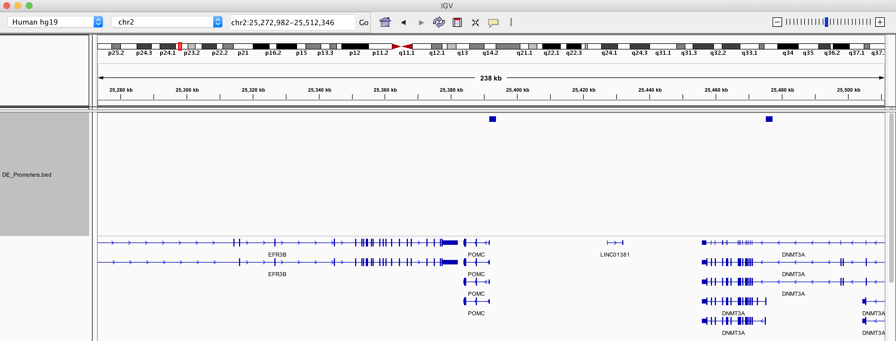

```{r setup, include=FALSE}
knitr::opts_chunk$set(echo = T,eval=T)
```

<p>&nbsp;</p>
These are answers for exercises that cover the Genomic Features sections of [Introduction to Bioconductor](https://rockefelleruniversity.github.io/Bioconductor_Introduction/).


## Working with Gene Models and annotation

In these exercises will gain some experience working with the Gene models and annnotation using the TxDb, OrgDb and GenomicFeatures packages.

1. Load the library TxDb.Mmusculus.UCSC.mm10.knownGene

```{r installBS, eval=TRUE,echo=FALSE}
suppressPackageStartupMessages(library(TxDb.Mmusculus.UCSC.mm10.knownGene))
```

```{r installBSsz, eval=FALSE}
library(TxDb.Mmusculus.UCSC.mm10.knownGene)
```

2. Count the number of genes and transcripts

```{r installBxxS2}
genelen <- length(genes(TxDb.Mmusculus.UCSC.mm10.knownGene))
txLen <- length(transcripts(TxDb.Mmusculus.UCSC.mm10.knownGene))
```

3. Plot the distribution of log10 gene lengths (as on genome including introns) across selected chromosomes (chr1, chr2, chr3) as density plots using ggplot2.

```{r installBS2dcxd3}
allGenes <- genes(TxDb.Mmusculus.UCSC.mm10.knownGene)
geneTable <- as.data.frame(allGenes)
filtGeneTable <- geneTable[geneTable$seqnames %in% c("chr1","chr2","chr3"),]
library(ggplot2)
ggplot(filtGeneTable,aes(x=width,fill=seqnames))+geom_density()+scale_x_log10()+facet_grid(seqnames~.)+theme_minimal()+scale_fill_discrete(name="Chromosome")
```

4. Retrieve the log10 transcript lengths (sum of exons in transcripts) and plot against the total log10 transcript lengths (as on genome including introns) for transcripts on chromosome 1 using ggplot2. Scale the size of points by the number of exons in a transcript.

```{r installBS2ssa3}
allTranscripts <- transcripts(TxDb.Mmusculus.UCSC.mm10.knownGene)
transcriptTable <- as.data.frame(allTranscripts)
filtTranscriptTable <- transcriptTable[transcriptTable$seqnames %in% c("chr1"),]
txLengths <- transcriptLengths(TxDb.Mmusculus.UCSC.mm10.knownGene)
toPlotTxLen <- merge(filtTranscriptTable,txLengths,all=FALSE,by="tx_name")
ggplot(toPlotTxLen,aes(x=width,y=tx_len,size=nexon))+geom_point()+scale_x_log10()+scale_y_log10()+theme_minimal()
```

5. Plot the nucleotide content for the longest transcript (by genomic size including introns) overlapping the region (chr1:3,083,473-3,876,510.) using ggplot2
 
```{r installBSsccs23,eval=TRUE}
allTX <- transcripts(TxDb.Mmusculus.UCSC.mm10.knownGene)
myRanges <- GRanges("chr1",IRanges(3083473,3876510))
filtTX <- allTX[allTX %over% myRanges]
orderedFiltTx <- filtTX[order(width(filtTX),decreasing = TRUE),]
longestTX <- orderedFiltTx[1]

library(BSgenome.Mmusculus.UCSC.mm10)

allSeqs <- extractTranscriptSeqs(BSgenome.Mmusculus.UCSC.mm10,TxDb.Mmusculus.UCSC.mm10.knownGene)
filtSeq <- allSeqs[longestTX$tx_id]
alpFreq <-alphabetFrequency(filtSeq)
atcgFreq <- alpFreq[,c("A","T","C","G")]
atcgFreqDF <- data.frame(Bases=names(atcgFreq),Frequency=atcgFreq)

ggplot(atcgFreqDF,aes(y=Frequency,x=Bases,fill=Bases))+geom_bar(stat = "identity")+theme_minimal()
```

6. Read in the expression table **GM12878_minus_HeLa.csv** from Data directory containing human/hg19 expression data.

```{r installBSsss23,eval=TRUE}
myDETable <- read.delim("data/GM12878_minus_HeLa.csv",sep=",",stringsAsFactors = FALSE)
```

7. In the **GM12878_minus_HeLa.csv** file, Column 1 contains Entrez IDs and column 2 contains symbols. Add a column of gene names to the table. 

```{r installBSsxxs23,eval=TRUE}
library(org.Hs.eg.db)
myAnnotationTable <- select(org.Hs.eg.db,keys=as.character(myDETable$ID),keytype = "ENTREZID",columns=c("ENTREZID","GENENAME"))
newTable <- merge(myAnnotationTable,myDETable,by=1,all.x=FALSE,all.y=TRUE)
newTable <- newTable[order(newTable$padj),]
```

7. Identify genes with a padj < 0.05 and logFC greater than 1. Export promoter positions (upstream 2000bp, downstream 50bp) of these genes's transcripts, merge overlapping promoters and export to a bed file and visualise in IGV. 

```{r installBSsxxs2as3,eval=TRUE}
genesToSelect <- newTable$ENTREZID[newTable$padj < 0.05 & !is.na(newTable$padj) & newTable$log2FoldChange > 1]
library(TxDb.Hsapiens.UCSC.hg19.knownGene)
myPromoters <- promoters(TxDb.Hsapiens.UCSC.hg19.knownGene,upstream = 2000,downstream = 50,columns=c("gene_id"))
selectedPromoters <- myPromoters[as.vector(myPromoters$gene_id) %in% genesToSelect]
reducedselectedPromoters <- reduce(selectedPromoters)
export.bed(reducedselectedPromoters,con="DE_Promoters.bed")
```



