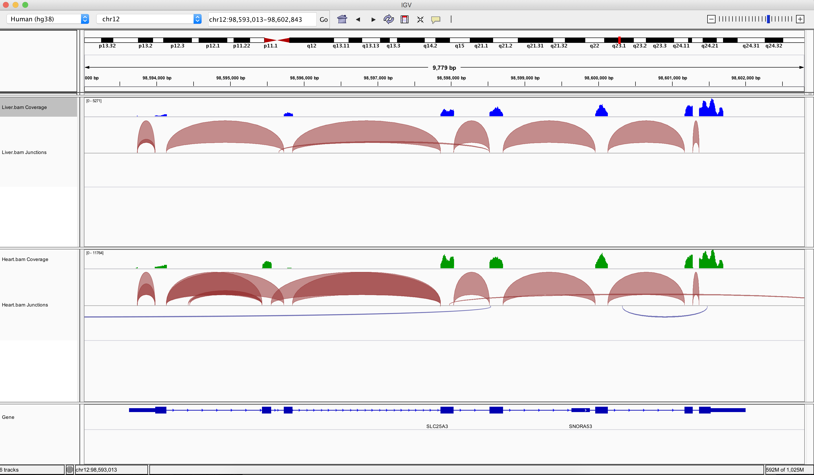

```{r setup, include=FALSE}
knitr::opts_chunk$set(echo = T,eval=T)
```

<p>&nbsp;</p>
These are answers for exercises that cover the Alignment sections of [Introduction to Bioconductor](https://rockefelleruniversity.github.io/Bioconductor_Introduction/).


## Alignment

In these exercises we will review some of the **Rsubread** packages functionality in alignment.

For these exercises we will be using some of the example data available from the BodyMap consortium. 

We have already reviewed this data when looking at IGV in an earlier session.


The example data can be found in the data directory 

**data/liver.bodyMap.fq**
**data/heart.bodyMap.fq**


1. Identify the number of reads in heart.bodyMap.fq and  liver.bodyMap.fq files.

```{r installdeBSded,include=FALSE}
suppressPackageStartupMessages(library(Rsubread))
suppressPackageStartupMessages(library(ShortRead))
suppressPackageStartupMessages(library(Rsamtools))
suppressPackageStartupMessages(library(ggplot2))
```

```{r installBSded}
library(Rsubread)
library(ShortRead)
library(ggplot2)
library(Rsamtools)
heartQ <- readFastq("data/heart.bodyMap.fq")
liverQ <- readFastq("data/liver.bodyMap.fq")
# length(heartQ)
# length(liverQ)
```

2. Create a violin plot of summed read qualities for the two samples in ggplot2

```{r installdesBSded}
heartQualities <- alphabetScore(quality(heartQ))
LiverQualities <- alphabetScore(quality(liverQ))
HFrame <- data.frame(Sample="Heart",Qualities=heartQualities)
LFrame <- data.frame(Sample="Liver",Qualities=LiverQualities)
toPlot <- rbind(HFrame,LFrame)
ggplot(toPlot,aes(x=Sample,y=Qualities,fill=Sample))+geom_violin()+theme_minimal()
```

3. Plot the overall frequency of A, C, G, T and N in the two samples using ggplot2
```{r installssBSded}
myFreqHeart <- colSums(alphabetFrequency(sread(heartQ)))
myFreqLiver <- colSums(alphabetFrequency(sread(liverQ)))
myFreqHeartFilt <- myFreqHeart[c("A","C","G","T","N")]
myFreqLiverFilt <- myFreqLiver[c("A","C","G","T","N")]
myFreqHeartDF <- data.frame(Sample="Heart",Bases=names(myFreqHeartFilt),Frequency=myFreqHeartFilt)
myFreqLiverDF <- data.frame(Sample="Liver",Bases=names(myFreqLiverFilt),Frequency=myFreqLiverFilt)
toPlot <- rbind(myFreqHeartDF,myFreqLiverDF)
ggplot(toPlot,aes(x=Bases,y=Frequency,fill=Bases))+geom_bar(stat="identity")+theme_minimal()+facet_grid(~Sample)

```

4. Create a FASTA file containing sequence for chromosome 12 from Human Hg38 genome build, with contig sequence named "chr12". Build an index with this FASTA. 

```{r instalsaslBSded,eval=FALSE}
library(Rsubread)

library(BSgenome.Hsapiens.UCSC.hg38)
chr12hg38 <- BSgenome.Hsapiens.UCSC.hg38[["chr12"]]
chr12hg38Set <- DNAStringSet(list(chr12=chr12hg38))
writeXStringSet(chr12hg38Set,file="chr12.fa")
buildindex("chr12","chr12.fa")
```

5. Align the two samples to the chromosome 12 FASTA file using Rsubread in a splice aware mode. Sort and index the resulting alignments

```{r instalssxlBSded,eval=FALSE}

FileName <- c("data/heart.bodyMap.fq","data/liver.bodyMap.fq")
OutputName <- c("data/heart.bodyMap.bam","data/liver.bodyMap.bam")

subjunc("chr12",FileName,
        output_format = "BAM",
        output_file = OutputName)

sortBam("data/heart.bodyMap.bam","Heart")
sortBam("data/liver.bodyMap.bam","Liver")

indexBam("Heart.bam")
indexBam("Liver.bam")
```

6. Count the number of unaligned reads in both samples. How many unique read IDs (QNAMEs) are there?

```{r instalslBSzzdxed,eval=FALSE}
quickBamFlagSummary("Heart.bam")
quickBamFlagSummary("Liver.bam")
```

7. Visualise the result in IGV

[HINT: Check Gene SLC25A3]


