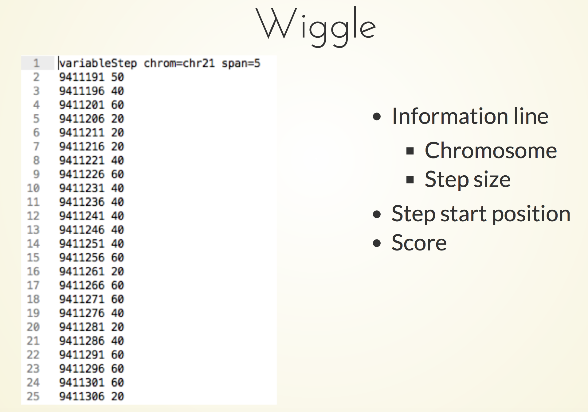
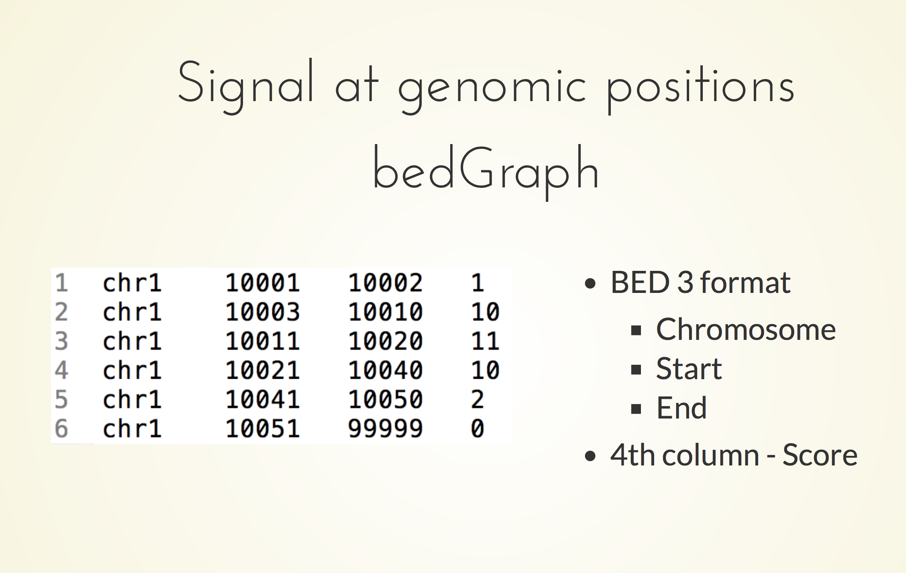
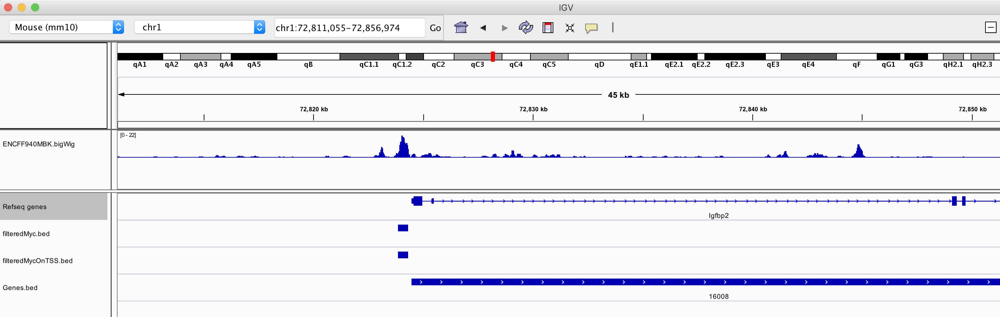
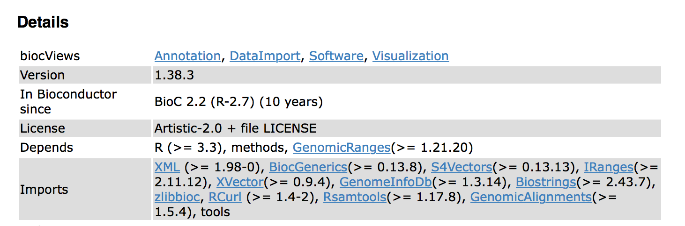
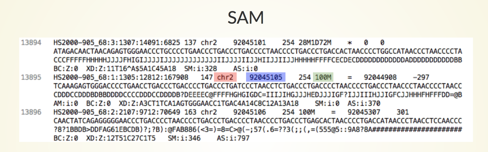

```{r setup, include=FALSE}
knitr::opts_chunk$set(echo = TRUE)
AsSlides <- TRUE
```

```{r makingData, include=FALSE,cache=TRUE}
library(rtracklayer)
myRanges <- GRanges("chr1",ranges = IRanges(72811055,72856974))
myRanges2 <- c(myRanges,GRanges("chr1",ranges = IRanges(1,100)))
mycPeaks <- import.bed("../../Data/Myc_Ch12_1_withInput_Input_Ch12_summits.bed")
mycPeaks[mycPeaks %over% myRanges]
toRun <- import("~/Downloads/ENCFF940MBK.bigWig",selection=BigWigSelection(myRanges),as="RleList")
export(toRun,con="../../Data/TSS_ENCFF940MBK.bedGraph")
export(toRun,con="../../Data/TSS_ENCFF940MBK.bw")
#xport.ucsc(toRun,con="../../Data/TSS_ENCFF940MBK.wig",subformat ="wig")
```


# Genomic Scores

As we have seen earlier, genomic scores are often stored in wiggle format.

<div align="center">

</div>

---

# Genomic Scores

A perhaps more common human readable format is bedGraph.

<div align="center">

</div>
---
# Genomic Scores

But in many situations we would want a highly compressed format such as bigWig.

We used a bigWig from Encode in our last session.





---
# Genomic Scores

Genomic Scores are heavily used in Genomics and High throughput sequencing as they offer a simple mechanism to review a defined metric over the linear genome at a specified resolution.

- RNA-seq, ChIP-seq, ATAC-seq signals (as well many other *seq* types).
- Phylogenetic conservation.


---
# Our Genomic Scores data.

In our last session [Genomic Intervals In Bioconductor](https://rockefelleruniversity.github.io/Bioconductor_Introduction/r_course/presentations/slides/GenomicIntervals_In_Bioconductor.html#1) we reviewed some of the Myc ChIP-seq signal available to us on encode. 

This was the data from Experiment [ENCSR000ERN](https://www.encodeproject.org/experiments/ENCSR000ERN/), containing information on Myc ChIP-seq in mouse genome version mm10 CH12 cell line.

If you have not already downloaded the bigWig file then download it from [this link](https://www.encodeproject.org/files/ENCFF940MBK/@@download/ENCFF940MBK.bigWig) for our exercise later

---
# Our Genomic Scores data.

From our last session we identified Myc peaks within the Igfbp2 locus and in IGV compared Myc ChIP-seq signal from Encode over our peaks.


---
# Our Genomic Scores data

For this course i have provided bedGraph and bigWig files from this data for the window with the IGV image.

We will demonstrate how to create this later in today's session but for now data is available in

**Data/TSS_ENCFF940MBK.bedGraph** - bedGraph of region.
**Data/TSS_ENCFF940MBK.bw** - bigWig of region.


---
# Genomic Scores in Bioconductor.

Two popular Bioconductor packages for dealing with Genomics Scores are:

- [**rtracklayer**](https://bioconductor.org/packages/release/bioc/html/rtracklayer.html) -- Importing/exporting genomic intervals into/out of R.
- [**GenomicRanges**](https://bioconductor.org/packages/release/bioc/html/GenomicRanges.html) -- Handling genomic intervals in R.

---

# Genomic Scores in Bioconductor.

Now we have the package installed, we can load the library **rtracklayer** which we will use to import and export from/to bedGraph and bigWig.

```{r sedfs,eval=TRUE,echo=FALSE}
suppressPackageStartupMessages(library(rtracklayer))
```

```{r ss,eval=FALSE}
library(rtracklayer)
```
---

# Genomic Scores in Bioconductor.

We will also be making use of the functions in the **GenomicRanges** package. We dont need to load **GenomicRanges** directly here because the **rtracklayer** does this for us.

Package dependencies and imports allow one package to make use of functions from another.


---

# Reading in a bedGraph.

The rtracklayer package provides functions to import genomic scores from a bedGraph using the **import.bedGraph()** function.


```{r c,eval=TRUE}
myBedG <- import.bedGraph("../../Data/TSS_ENCFF940MBK.bedGraph")
```
---
# Reading in a bedGraph.

The genomic scores by default are stored as a familiar [**GRanges object**](https://rockefelleruniversity.github.io/Bioconductor_Introduction/r_course/presentations/slides/GenomicIntervals_In_Bioconductor.html#9) containing the original 4 columns of information, **contig**, **start**, **end** and **score**. 


```{r b,eval=TRUE}
myBedG[1:3]
```
---
# Reading in a bedGraph.

Because we only have 4 columns in a bedGraph and no strand information, the **GRanges** intervals are unstranded with * in their strand column


```{r d,eval=TRUE}
strand(myBedG)
```


---
# Reading in a bigWig

Much of the genomic scores we will be working with are infact stored in the compressed bigWig format.

We can also import bigWigs into R using the **import.bw** function.

```{r e,eval=TRUE}
myBigWig <- import.bw("../../Data/TSS_ENCFF940MBK.bw")
```
---
# Reading in a bigWig

The import bigWig's genomic scores are again imported as a **GRanges** object containing the same information as the imported bedGraph.

```{r f,eval=TRUE}
myBigWig[1:3]
```

---
# GenomicScores as a GRanges

So far we have retrieved our genomic scores from bedGraphs and bigWigs as **GRanges** objects.

This allows us to use **GRanges** accessors and functions we have already [seen in our last session.](https://rockefelleruniversity.github.io/Bioconductor_Introduction/r_course/presentations/slides/GenomicIntervals_In_Bioconductor.html#32)

```{r g,eval=TRUE}
myGRanges <- GRanges("chr1",IRanges(72823698,72824485))
filteredBigWig <- myBigWig[myBigWig %over% myGRanges]
filteredBigWig[1:3]
```


---
# GenomicScores as a RLE

We can however specify the type of objects we would like to return from the import.bedGraph and import.bw functions.

Here we will import the bigWig as a object we have briefly seen, the **Rle** object (run length encoding). Here we have an **Rlelist** (a list of **Rle** objects)

```{r h,eval=TRUE}
myBigWig <- import.bw("../../Data/TSS_ENCFF940MBK.bw",
                      as = "RleList")
class(myBigWig)
```
---

# Rle in genomics

Run length encoding allows for a very efficient storage of long stretchs of repeated values.

We have already seen an rle in our cigar string from SAM files.

* 100M - 100 matches to reference for alignment
* 28M1D72M - 28 matches, 1 deletion and 72 matches for aligment



---
# Rle in genomics
For genomic scores we will be storing long stretchs of numbers as an **Rle**.

To store genomic scores across chromosomes/contig we will use an **RleList**.

Creating an **Rle** is straightforward. We can simply supply a numeric vector of numbers we wish to compress to the **Rle()** function.

```{r hqq,eval=TRUE}
myNumbers <- c(0,0,0,0,0,1,1,1,0,0,0,0,0)
Rle(myNumbers)
```

---
# Rle in genomics

Now can construct a named **RleList** containing the **Rle** objects using the **RleList()** function.

```{r hss,eval=TRUE}
myNumbers2 <- c(0,0,0,0,0,1,1,1,2,2,2,2,2)
chr1Scores <- Rle(myNumbers)
chr2Scores <- Rle(myNumbers2)
myRleList <- RleList(chr1=chr1Scores,chr2=chr2Scores)
myRleList
```

---
# Rle in genomics

**Rle** allows for us to compress space needed to store genomic scores and so the Bioconductor **Rle** and **RleList** objects allows us make use of this in R. 

We can see the compression of space in action by reviewing our imported genomic scores as an **RleList** objects.

```{r i,eval=TRUE}
myBigWig[1:2]
```


---
# Indexing an RLElist

To access elements of a RleList we can use our regular accessors for lists **$** and **[[]]**.

Here we retrieve the Rle object named *chr1* containing all the genomic scores information for chromosome 1.


```{r j,eval=TRUE}
chr1_rle <- myBigWig$chr1
# Or
chr1_rle <- myBigWig[["chr1"]]
chr1_rle
```


---
# Indexing an RLE

Now we have an Rle object of our genomic scores on chromosome 1 we can index it just like we have for standard vectors.
Here i retrieve values for all basepairs between 1 and 10

```{r k,eval=TRUE}
chr1_rle[1:10]
```


---
# Replacement in an RLE.

We can also replace values in a **Rle**, just as we would with a vector.

Here i replace values for all basepairs between 1 and 10 to 100

```{r l,eval=TRUE}
chr1_rle[1:10] <- 100
chr1_rle
```

---
# Converting to other data types

We can convert **Rle's** to standard vectors.

```{r m,eval=TRUE}
rleAsVector <- as.vector(chr1_rle[1:10])
rleAsVector
```

---
# Converting to other data types

Or to a data.frame

```{r n,eval=TRUE}
rleAsDF <- as.data.frame(chr1_rle[1:10])
rleAsDF
```

---
# Working with Rle

Many vector operations and function work with **Rle** objects.

These include

* Arithmetric and Mathematical operations.
* Logical operations and comparisons/
* Summary statistics.


---
# Operations on RLE. (Arithmetric and Mathematical)

We can use many simple arithmetric operations such as **+**, **-**, **/** and *****

```{r o,eval=TRUE}
chr1_rle+1000
(chr1_rle+1000)*10
```
---
# Operations on RLE. (Arithmetric and Mathematical)

Logical operations can be used with **Rle** objects just as with vectors.

For **Rle** objects, logical opertations return a logical Rle instead of standard logical vector.


```{r o1,eval=TRUE}
chr1_rle < 10
```
---
# Operations on RLE. (Arithmetric and Mathematical)

We use this **logical Rle** to replace values less than 10 with 0 as we would use a [logical vector with standard vectors](https://rockefelleruniversity.github.io/Intro_To_R_1Day/r_course/presentations/slides/introToR_Session1.html#/32).

```{r o3,eval=TRUE}
chr1_rle[chr1_rle < 10] <- 0
chr1_rle
```

---
# Operations on RLE. (Summaries)

Many functions providing summary statisitics are also available to us including **mean()**, **max()** and **sum()** functions.

```{r o2,eval=TRUE}
mean(chr1_rle)
max(chr1_rle)
sum(chr1_rle)
```

---
# Operations on RLELists

Very usefully, We can also apply arithmetic and mathematical operations to whole RleLists as imported from the bigWig file.

```{r o4,eval=TRUE}
myBigWig <- import.bw("../../Data/TSS_ENCFF940MBK.bw",as="RleList")
myBigWig+10
```
---
# Summaries on RLELists

Summary functions return a summary for every Rle object (here for chromosomes) within the RleList.


```{r o4s,eval=TRUE}
chromosomeMax <- max(myBigWig)
chromosomeMax[1:4]
```

---
# Subsetting RleLists with a GRanges.

We can in fact use **GRanges** objects to index our **RleList** objects.The **GRanges** provides the intervals from which genomic scores are retrieved. The resulting **RleList** object contains an entry with the scores for each interval in the **GRanges** object.

To demonstrate first we can retrieve the Myc Peaks calls which overlap the region we are reviewing.

```{r oa4,eval=TRUE}
myRanges <- GRanges("chr1",ranges = IRanges(72811055,72856974))
mycPeaks <- import.bed("../../Data/Myc_Ch12_1_withInput_Input_Ch12_summits.bed")
mycPeaks <- resize(mycPeaks,50,fix="center")
newMycPeaks <- mycPeaks[mycPeaks %over% myRanges]
newMycPeaks
```

---
# RleLists and GRanges.

Now we can simply index our RleList object by providing our **GRanges** as an index in **[]** brackets.

```{r v,eval=TRUE}
rleOverGranges <- myBigWig[newMycPeaks]
rleOverGranges
```
---
# RleLists and GRanges.

With the **RleList** containing our scores over the Myc peaks we can now gather summary statistics as with all RleList objects 

```{r w,eval=TRUE}
sum(rleOverGranges)
```

---
# Exporting an RLElist

We may wish to export our **RleList** or **Rle** objects back to a bigWig file.

We would need to convert any **Rle** objects to a **RleList** first in order to provide some chromosome/contig names. We can do this with the **RleList()** function and providing a chromosome/contig name to our **Rle** object.

```{r p1,eval=TRUE}
myRleList <- RleList(chr1=chr1_rle)
myRleList
```

---

# Exporting an RLElist

Now we have our **RleList** object we export this to a bigWig using the **export.bw()** function.

```{r q,eval=TRUE}
export.bw(myRleList,con="chr1_Myc.bw")
```
---
# Importing large files

In some cases we will only wish to import portions of a BigWig file for use in our analysis. This will save us memory and time when loading in big files.


To do this we can take advantage of the **selection** parameter in the **import.bw** function and the **BigWigSelection()** function. 

---
# Importing large files

When importing only a portion of a bigWig we simply need to specify a GRanges of regions we wish to retrieve to the **BigWigSelection()** function.

Here we will use the Myc Peaks in our window as the GRanges of regions for selection.

```{r x,eval=TRUE}
newMycPeaks
```
---
# Importing large files

Now we pass the Myc peak **GRanges** object to the **BigWigSelection()** function.

We then supply the resulting **BigWigSelection** selection object to the **selection** parameter of **import.bw()** function.

```{r z,eval=TRUE}

mySelection <- BigWigSelection(newMycPeaks)
import.bw("../../Data/TSS_ENCFF940MBK.bw", 
          selection=mySelection, 
          as="RleList")
```

---
# Time for an exercise.

[Link_to_exercises](../../exercises/GS_exercises.html)

[Link_to_answers](../../answers/GS_answers.html)


